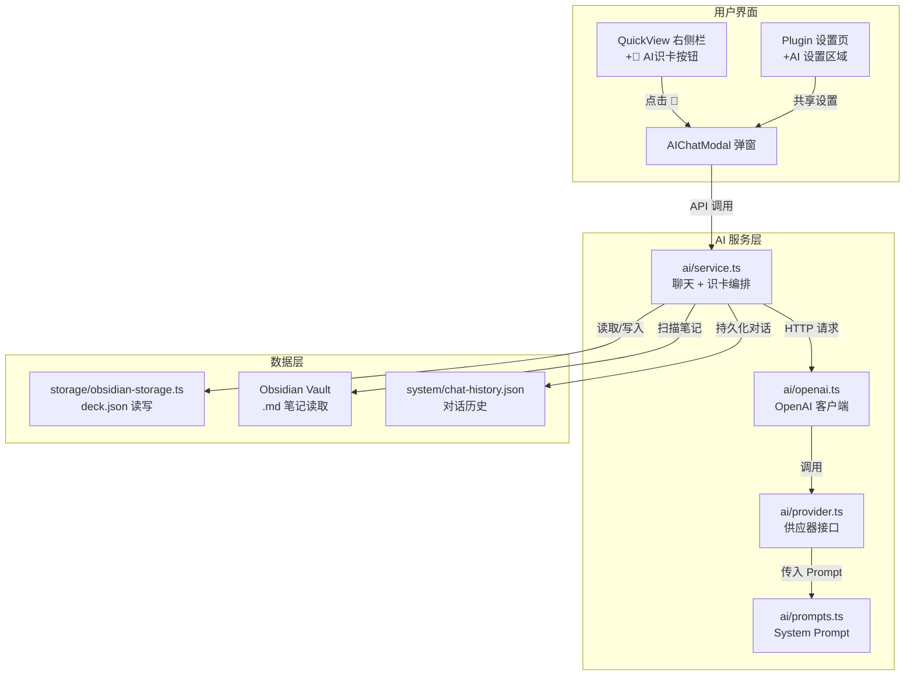
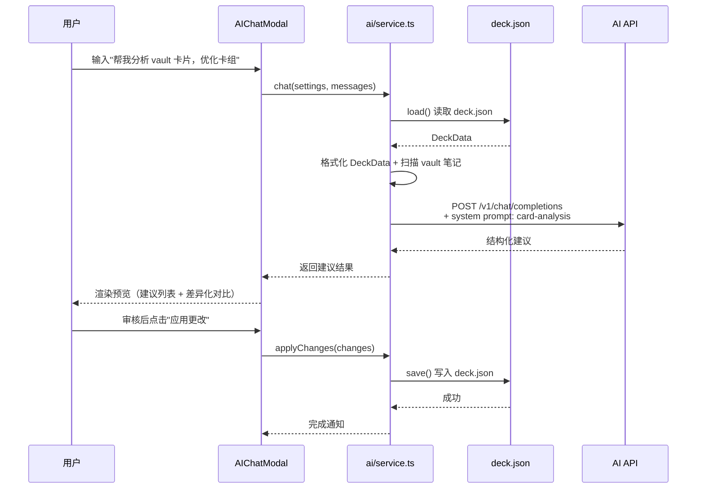

# AI 识卡功能设计方案

## 概述

在 RemiFocus 右侧栏添加 AI 识卡功能，基于 OpenAI 兼容 API，实现对 vault 中卡片的智能分析、整理和提取。

---

## 1. 新增文件结构

```
ai/
  types.ts           AI 类型定义（消息、配置、角色等）
  provider.ts        AI 供应器抽象接口
  openai.ts          OpenAI 兼容 API 客户端实现
  service.ts         AI 高级服务（聊天 + 卡片识别编排）
  prompts.ts         System Prompt 模板（卡片分析/提取）

ui/
  aiChat.ts          AI 聊天弹窗（主 UI 组件）
```

---

## 2. 类型定义 (`ai/types.ts`)

```typescript
// ─── AI 设置 ───
export interface AISettings {
  provider: string;         // "openai" | "custom"
  apiKey: string;
  baseUrl: string;          // 默认 https://api.openai.com/v1
  model: string;            // 默认 gpt-4o-mini
  maxTokens: number;        // 默认 4096
  temperature: number;      // 默认 0.7
}

// ─── 聊天消息 ───
export type ChatRole = "system" | "user" | "assistant";

export interface ChatMessage {
  role: ChatRole;
  content: string;
  timestamp: number;        // 用于展示
}

// ─── 聊天会话 ───
export interface ChatSession {
  id: string;
  title: string;            // 自动生成或用户设定
  messages: ChatMessage[];
  createdAt: number;
  updatedAt: number;
}

// ─── AI 响应差异结果 ───
export interface AIDiffResult {
  type: "deck-reorganize" | "card-extract" | "card-suggest";
  summary: string;
  changes: Array<{
    action: "create" | "update" | "delete" | "move";
    target: string;          // deck 名 / 单词
    detail: string;
  }>;
}
```

---

## 3. 架构图



---

## 4. 数据流：卡片分析场景



---

## 5. 聊天弹窗 UI 设计

```
┌─────────────────────────────────────────────────┐
│  🤖 AI 识卡                              [✕]   │
├──────────────┬──────────────────────────────────┤
│  📋 对话历史   │  💬 对话区域                      │
│              │                                  │
│  ┌────────┐  │  ┌──────────────────────┐        │
│  │ 会话 1  │  │  │ 🧑 帮我分析 vault     │        │
│  │ 会话 2  │  │  │    中的所有卡片       │        │
│  │ 会话 3  │  │  └──────────────────────┘        │
│  │ 会话 4  │  │  ┌──────────────────────┐        │
│  │ 会话 5  │  │  │ 🤖 扫描完成！          │        │
│  └────────┘  │  │                      │        │
│  ┌────────┐  │  │ 📊 分析结果：           │        │
│  │ + 新建  │  │  │ • 发现 3 个空卡组      │        │
│  └────────┘  │  │ • 建议合并 2 组重复词   │        │
│              │  │ • 从笔记中发现 15 个    │        │
│              │  │   未收录的候选词        │        │
│              │  │                      │        │
│              │  │ ┌────────────────┐    │        │
│              │  │ │  [预览详情] [应用]│    │        │
│              │  │ └────────────────┘    │        │
│              │  └──────────────────────┘        │
├──────────────┴──────────────────────────────────┤
│  ⚙️ 设置  │  [输入消息...]  [发送 ▶]            │
└─────────────────────────────────────────────────┘
```

---

## 6. 设置面板（双入口）

### 6.1 插件设置页新增 AI 区域

在 [`main.ts:82`](main.ts:82) `RemiFocusSettingTab` 中添加 `AI 设置` 区块：

| 设置项 | 类型 | 默认值 | 说明 |
|--------|------|--------|------|
| API 地址 | text input | `https://api.openai.com/v1` | OpenAI 兼容的 Base URL |
| API Key | password input | 空 | 用户填入自己的 API Key |
| 模型 | text input | `gpt-4o-mini` | 模型名称 |
| 最大 Token | slider (512-8192) | 4096 | 单次响应上限 |
| 温度 | slider (0-2) | 0.7 | 创造力参数 |

### 6.2 弹窗内设置面板

点击左下角 `⚙️` 弹出内嵌设置面板，内容与插件设置页一致。

两者数据源是同一个 — 存储在 `ObsidianPlugin.loadData/saveData` 中。

---

## 7. AI Service 方法设计

```typescript
// ai/service.ts
export class AIService {
  constructor(private settings: AISettings, private vault: Vault) {}

  // ─── 基础聊天 ───
  async chat(messages: ChatMessage[]): Promise<string>

  // ─── 卡片分析（分析 deck.json 数据） ───
  async analyzeCards(deckData: DeckData): Promise<AIDiffResult>

  // ─── 笔记扫描（读取 .md 文件提取候选卡片） ───
  async scanNotes(files: TFile[]): Promise<AIDiffResult>

  // ─── 应用 AI 建议 ───
  async applyChanges(diff: AIDiffResult): Promise<void>
}
```

---

## 8. System Prompt 模板 (`ai/prompts.ts`)

### 8.1 卡片分析 Prompt
```
你是一个学习卡片管理专家。以下是 RemiFocus 插件 deck.json 的数据：

[deck.json 格式化内容]

请分析并返回 JSON 格式建议，包含：
1. 卡组结构优化：哪些卡组可以合并/重命名/删除
2. 重复卡片：哪些单词在多个卡组中重复
3. 学习状态异常：长期未复习 / 间隔异常的卡片
4. 候选新卡片：扫描笔记后发现的未收录词
```

### 8.2 通用聊天 Prompt
```
你是一个 AI 学习助手，帮助用户管理 RemiFocus 中的单词卡片。
你可以回答关于学习方法、卡片组织、复习策略的问题。
当前 vault 共有 {totalCards} 张卡片，{totalDecks} 个卡组。
```

---

## 9. 实施步骤

| # | 任务 | 文件 | 说明 |
|---|------|------|------|
| 1 | 定义 AI 类型 | `ai/types.ts` | 新增文件：AISettings, ChatMessage, ChatSession, AIDiffResult |
| 2 | 实现 AI 供应器 | `ai/provider.ts` + `ai/openai.ts` | 抽象接口 + OpenAI 兼容实现 |
| 3 | 实现 AI Service | `ai/service.ts` + `ai/prompts.ts` | 聊天 + 识卡编排逻辑 |
| 4 | 扩展设置接口 | `main.ts` | 新增 AISettings 到 RemiFocusSettings + 设置页 UI |
| 5 | 实现 AI 聊天 UI | `ui/aiChat.ts` | 弹窗组件：左侧历史 + 右侧聊天 + 底部输入 + 设置 |
| 6 | 更新 QuickView | `ui/quickView.ts` | 右侧栏添加 "🤖 AI识卡" 按钮 |
| 7 | 注册插件入口 | `main.ts` | 注册 AIChatModal + 命令 + ribbon |
| 8 | 添加样式 | `styles.css` | AI 弹窗、消息气泡、设置面板样式 |
| 9 | 对话持久化 | `ai/service.ts` | 聊天历史保存到 system/chat-history.json |
| 10 | 预览确认机制 | `ui/aiChat.ts` | AI 建议以预览卡片形式展示，用户确认后应用 |

---

## 10. 关键设计决策

1. **API Key 安全**：存储在 Obsidian `data.json` 中（插件自有数据文件），不存入 `deck.json`
2. **无额外依赖**：使用 `fetch()` 调用 API（Obsidian 内置），无需引入 `axios` 等库
3. **对话持久化**：保存到 `system/chat-history.json`，用户可清空历史
4. **预览后应用**：AI 返回的结构化建议先渲染为可审查的 UI，用户手动触发写入
5. **双入口设置**：插件设置页 + 弹窗内设置面板，共享同一数据源
