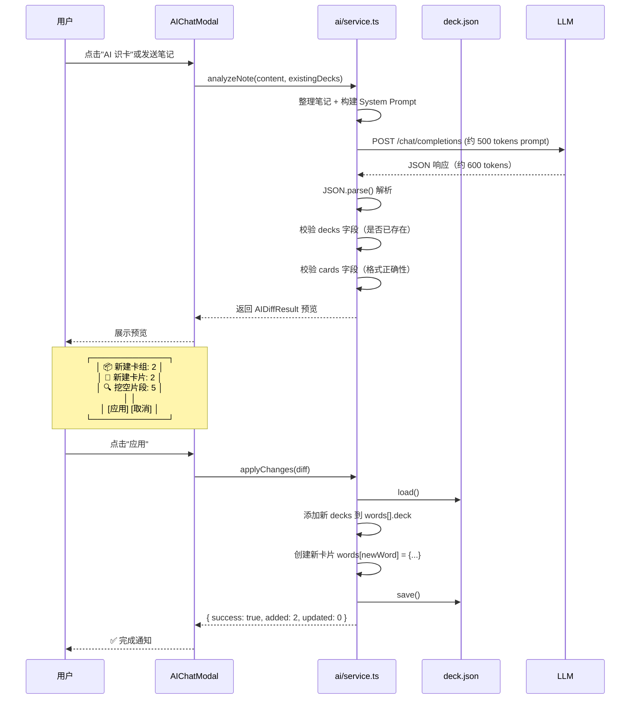

# AI 识卡：结构化 JSON 交互协议详解

## 核心问题

> "AI 只会输出文本，怎么让它识别卡片、挖空、创建卡组？"

**答案：用结构化 JSON 作为 LLM 和插件之间的"协议语言"。** LLM 输出 JSON，插件解析 JSON 执行实际操作。

---

## 1. 协议架构

```mermaid
flowchart LR
    subgraph 输入到 LLM
        NP[当前笔记内容<br/>markdown]
        SP[System Prompt<br/>卡片识别指令]
        DP[现有卡组列表<br/>避免重复]
    end

    subgraph LLM 处理
        LLM[LLM 分析笔记<br/>理解语义<br/>识别关键概念]
    end

    subgraph 输出 JSON
        J1[{"decks": [...]}]
        J2[{"cards": [...]}]
        J3[{"cloze": [...]}]
    end

    subgraph 插件执行
        PS[解析 JSON]
        SC[创建/更新卡组]
        CC[创建卡片 + 挖空]
    end

    NP --> LLM
    SP --> LLM
    DP --> LLM
    LLM --> J1
    LLM --> J2
    LLM --> J3
    J1 --> PS
    J2 --> PS
    J3 --> PS
    PS --> SC
    PS --> CC
```

---

## 2. LLM 输入（Token 优化版）

### 2.1 System Prompt（约 400 tokens）

```
你是一个智能卡片制作助手。根据用户提供的笔记内容，提取知识点并生成 JSON。

## 输出格式
你必须返回一个 JSON 对象（不要包含 markdown 代码块标记）：

{
  "decks": [
    { "name": "卡组路径", "description": "说明" }
  ],
  "cards": [
    {
      "word": "术语/单词",
      "meaning": "定义/解释",
      "deck": "所属卡组路径",
      "cloze": [
        { "hint": "提示文本", "answer": "答案" }
      ]
    }
  ]
}

## 规则
1. decks: 根据笔记章节/主题创建 1-3 个卡组，路径格式: 笔记名/子主题
2. cards: 每个卡片是一个独立的知识点
   - word: 核心术语（简短）
   - meaning: 完整定义
   - deck: 引用上面 decks 中的 name
3. cloze: 智能挖空
   - 对每个卡片，识别 1-3 个关键填空点
   - hint: 填空的上下文线索（10-30字）
   - answer: 被隐藏的答案
4. 优先提取：定义型内容、列举型内容、对比型内容
5. 忽略：无意义列表、导航文本
6. 总卡片数不要超过 15 张，用最少的卡片覆盖核心知识点
```

### 2.2 用户消息（笔记内容 + 现有 deck 概览）

```
## 当前笔记
{notes_content}

## 现有卡组
{existing_decks_summary}
```

**Token 控制策略：**
- 笔记过长时（>3000 chars），按段落分割，分批发送
- 现有卡组只传名称列表（不传完整数据），约 50 tokens
- 用户点"继续"再处理下一批

---

## 3. LLM 输出示例

假设用户笔记是：

```
## 心血管系统

### 动脉血压
动脉血压的形成条件包括：
1. 循环血量充足 - 前提条件
2. 心脏射血 - 动力来源
3. 外周阻力 - 维持舒张压
4. 大动脉弹性 - 缓冲收缩压

### 高血压
高血压定义为收缩压 ≥ 140mmHg 或舒张压 ≥ 90mmHg
```

LLM 返回的 JSON：

```json
{
  "decks": [
    { "name": "心血管系统/动脉血压", "description": "动脉血压的形成条件" },
    { "name": "心血管系统/高血压", "description": "高血压诊断标准" }
  ],
  "cards": [
    {
      "word": "动脉血压形成条件",
      "meaning": "1. 循环血量充足 2. 心脏射血 3. 外周阻力 4. 大动脉弹性",
      "deck": "心血管系统/动脉血压",
      "cloze": [
        { "hint": "动脉血压形成的四大条件包括循环血量充足、心脏射血...", "answer": "外周阻力" },
        { "hint": "维持舒张压的关键条件是...", "answer": "外周阻力" },
        { "hint": "缓冲收缩压的结构是...", "answer": "大动脉弹性" }
      ]
    },
    {
      "word": "高血压诊断标准",
      "meaning": "收缩压 ≥ 140mmHg 或舒张压 ≥ 90mmHg",
      "deck": "心血管系统/高血压",
      "cloze": [
        { "hint": "收缩压达到多少可诊断为高血压...", "answer": "140mmHg" },
        { "hint": "舒张压达到多少可诊断为高血压...", "answer": "90mmHg" }
      ]
    }
  ]
}
```

---

## 4. 插件端解析逻辑



---

## 5. 智能挖空（Cloze）的具体实现

### 5.1 LLM 端识别逻辑

LLM 被要求对每个卡片做以下判断：
- 这句话中哪个部分是**核心考点**？→ 设为 `answer`
- 它的上下文提示是什么？→ 设为 `hint`
- 允许多个挖空点

### 5.2 插件端渲染逻辑

对于现有卡片模型中 [`models/card.ts:17`](models/card.ts:17) 的 `ClozeSegment`：

```
显示: 维持舒张压的关键条件是_______
点击: → 显示"外周阻力"
```

渲染方式复用在 [`ui/sessionView.ts`](ui/sessionView.ts) 中已经实现的 cloze 逐段揭示机制。

### 5.3 新卡片的 deck.json 存储

```json
{
  "words": {
    "动脉血压形成条件": {
      "meaning": "1. 循环血量充足 2. 心脏射血 3. 外周阻力 4. 大动脉弹性",
      "deck": ["心血管系统/动脉血压"],
      "state": "new",
      "ease": 250,
      "interval": 0,
      "next": null,
      "history": [],
      "cloze": [
        { "hint": "动脉血压形成的四大条件包括循环血量充足、心脏射血...", "answer": "外周阻力" },
        { "hint": "维持舒张压的关键条件是...", "answer": "外周阻力" }
      ],
      "source": "ai"
    }
  }
}
```

注意 `source: "ai"` — 标记为 AI 生成的卡片。

---

## 6. Token 预算分析（单次请求）

| 项目 | 估算 tokens | 说明 |
|------|------------|------|
| System Prompt | ~400 | 固定的识别指令 + JSON schema |
| 笔记内容 | ~500–1500 | 正常笔记长度，超过 3000 字符分批 |
| 现有卡组列表 | ~50 | 只传名称不传内容 |
| **输入合计** | **~950–1950** | |
| LLM 输出 JSON | ~300–800 | 正常情况 5-15 张卡片 |
| **单次总消耗** | **~1250–2750** | 约 $0.001–0.003 (gpt-4o-mini) |

**优化策略：**
1. 笔记超长时截取前 3000 字符，提示"还有更多内容，是否需要继续？"
2. 用户可手动选择笔记中的特定段落发送
3. 使用 gpt-4o-mini / deepseek-chat 等低成本模型

---

## 7. 处理流程：用户视角

```
用户打开笔记 → 点击右侧栏 🤖 AI识卡
  → 弹窗打开，自动检测当前笔记
  → 显示：检测到当前笔记「心血管系统」，是否分析？
  → 用户确认
  → 发送到 LLM → 等待 2-5 秒
  → 返回预览卡片：

  ┌──────────────────────────────────┐
  │  🤖 AI 识卡 - 分析结果           │
  │                                  │
  │  📦 建议新建卡组:                │
  │    ☑ 心血管系统/动脉血压         │
  │    ☑ 心血管系统/高血压           │
  │                                  │
  │  📝 建议新建卡片:                │
  │    ☑ 动脉血压形成条件 (含3挖空)  │
  │    ☑ 高血压诊断标准   (含2挖空)  │
  │                                  │
  │  ┌──────────────────────────┐    │
  │  │   预览卡片详情 🡕         │    │
  │  └──────────────────────────┘    │
  │                                  │
  │       [取消]    [✓ 应用]         │
  └──────────────────────────────────┘

  用户点击"预览卡片详情"可展开查看每个卡片的具体内容
  
  用户点击"应用"：
  → deck.json 更新
  → Notice: ✅ 已创建 2 个卡组，添加 2 张卡片
```

---

## 8. 核心代码调用链（伪代码）

```typescript
// ai/service.ts
export class AIService {
  async analyzeNote(
    noteContent: string,
    existingDeckNames: string[],
    noteName: string
  ): Promise<AIDiffResult> {
    // 1. 构建 prompt
    const systemPrompt = buildSystemPrompt();      // 约 400 tokens
    const userMessage = buildUserMessage(           // 笔记 + 现有卡组
      noteContent, existingDeckNames, noteName
    );

    // 2. 调用 LLM
    const rawJson = await this.callLLM([
      { role: "system", content: systemPrompt },
      { role: "user", content: userMessage }
    ]);

    // 3. 解析 JSON
    const parsed = safeParseJSON(rawJson);
    if (!parsed) return this.handleParseError();

    // 4. 校验 + 去重
    const diff = this.validateAndDiff(parsed, existingDeckNames);

    return diff;
  }

  async applyChanges(diff: AIDiffResult): Promise<void> {
    const deckData = await this.storage.load();

    for (const card of diff.cards) {
      const word = card.word.toLowerCase().trim();
      if (!deckData.words[word]) {
        deckData.words[word] = {
          meaning: card.meaning,
          deck: [card.deck],
          state: "new",
          ease: 250,
          interval: 0,
          next: null,
          history: [],
          cloze: card.cloze,
          source: "ai"
        };
      } else {
        // 合并到已有卡片的 deck 列表
        if (!deckData.words[word].deck.includes(card.deck)) {
          deckData.words[word].deck.push(card.deck);
        }
      }
    }

    await this.storage.save(deckData);
  }
}
```

---

## 9. 总结

| 你的担心 | 解决方案 |
|---------|---------|
| AI 只输出文本，怎么"识别"卡片？ | AI 输出**结构化 JSON**，插件解析后执行实际 DOM/数据操作 |
| 怎么创建卡组？ | JSON 中 `decks[]` 定义新卡组名，插件根据路径自动创建 |
| 怎么智能挖空？ | JSON 中 `cards[].cloze[]` 定义挖空点和答案 |
| Token 太多怎么办？ | ① 每次只处理**当前笔记**（不是整个 vault） ② 超长笔记分批 ③ 用 gpt-4o-mini 低成本模型 |
| 多张卡片怎么自动放入对应卡组？ | 每张 card 的 `deck` 字段直接引用卡组名，插件写入时自动归类 |
