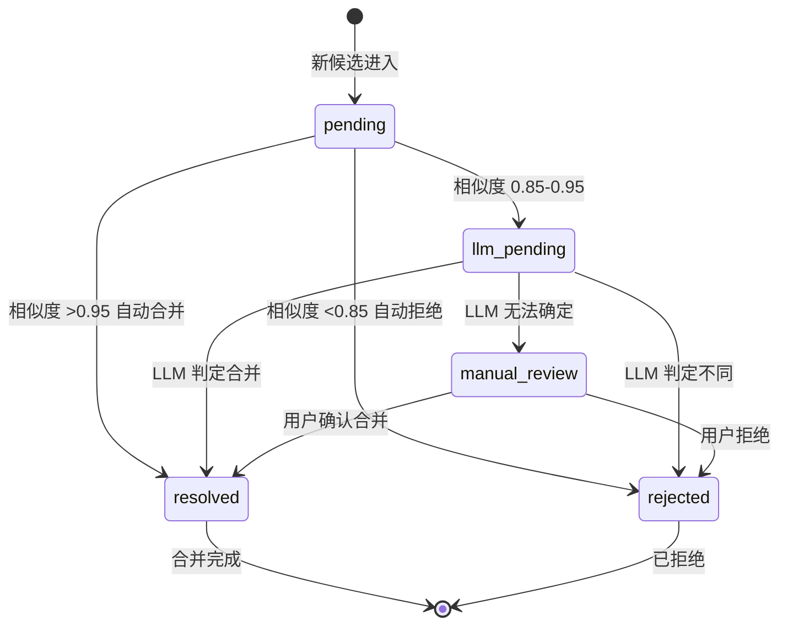
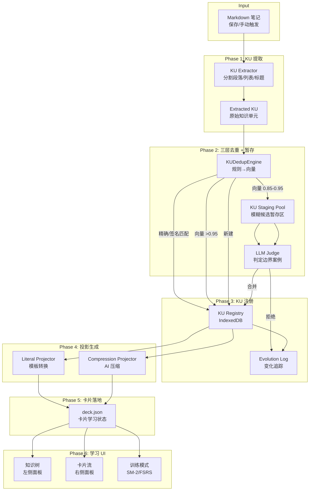

# RemiFocus 工程级架构设计 — 学习编译器

> 基于前面全部讨论的最终整合版

---

## 0. 核心设计原则

```
1. 最小知识单元（KU）是系统的「原子」，卡片只是「投影」
2. KU 不允许被 AI 改结构，只能改视图（Stability Layer）
3. 模糊合并必须进入暂存区（Staging Pool），不能自动生效
4. 每一次 KU 的变化都必须可追溯（Evolution Log）
5. 知识树负责理解结构，卡片流负责训练记忆
6. 完全向后兼容现有 deck.json
```

---

## 一、完整目录结构

```
remifocus/
├── main.ts                      # 插件入口 + 设置页
├── manifest.json
├── styles.css                   # 所有 UI 样式
├── tsconfig.json
├── package.json
│
├── models/                      # 数据模型
│   ├── index.ts                 # 统一导出
│   ├── card.ts                  # WordEntry（已有，+3字段）
│   ├── knowledge-unit.ts        # KU 核心类型（新增）
│   ├── projection.ts            # 投影 + CardFace（新增）
│   ├── staging.ts               # 暂存区类型（新增）
│   └── evolution.ts             # 演化日志类型（新增）
│
├── engine/                      # 学习引擎（不变）
│   ├── index.ts
│   ├── interface.ts
│   └── session.ts
│
├── resolver/                    # 解析器
│   ├── index.ts
│   ├── cardExtractor.ts         # 卡片提取（已有）
│   ├── ku-extractor.ts          # 笔记 → KU 解析（新增）
│   ├── ku-store.ts              # KU 持久化（新增）
│   ├── ku-dedup.ts              # 三层去重引擎（新增）
│   ├── ku-staging.ts            # 暂存区管理（新增）
│   ├── ku-stability.ts          # 稳定性层（新增）
│   └── embedding.ts             # 向量嵌入服务（新增）
│
├── ai/                          # AI 服务层
│   ├── index.ts
│   ├── types.ts                 # AI 设置 + 消息类型
│   ├── provider.ts              # 供应器抽象接口
│   ├── openai.ts                # OpenAI 兼容客户端
│   ├── service.ts               # 聊天编排
│   ├── compression-service.ts   # 压缩模式生成（新增）
│   └── prompts.ts               # System Prompt 模板
│
├── scheduler/                   # 调度器（不变）
│   ├── index.ts
│   ├── interface.ts
│   ├── sm2.ts
│   ├── fsrs.ts
│   ├── exam.ts
│   └── fixed-interval.ts
│
├── storage/                     # 存储层
│   ├── index.ts
│   ├── interface.ts
│   ├── deck-storage.ts
│   ├── obsidian-storage.ts      # deck.json 读写（已有）
│   └── ku-database.ts           # KU IndexedDB 数据库（新增）
│
├── ui/                          # UI 组件
│   ├── index.ts
│   ├── base.ts                  # UIComponent 基类
│   ├── quickView.ts             # 右侧栏（已有，+AI识卡按钮）
│   ├── aiChat.ts                # AI 聊天弹窗（新增）
│   ├── knowledgeTree.ts         # 知识树组件（新增）
│   ├── cardStream.ts            # 卡片流组件（新增）
│   ├── knowledgeUnitModal.ts    # KU 详情弹窗（新增）
│   ├── stagingReview.ts         # 暂存区审查 UI（新增）
│   └── conflictResolver.ts      # 冲突解决 UI（新增）
│
├── modes/                       # 学习模式（不变）
├── utils/                       # 工具函数
├── tests/                       # 测试
│
└── system/                      # 数据存储
    ├── deck.json                # 卡片学习状态（已有）
    └── knowledge-units.json     # KU 注册表快照（新增，用于同步备份）
```

---

## 二、IndexedDB 数据库设计（核心存储）

因为 Obsidian 插件运行在浏览器环境，KU 数据量可能很大（embedding 向量等），不适合全部放 JSON 文件。采用 **IndexedDB + JSON 快照** 双轨策略。

### Database: `remifocus-ku`

#### Table 1: `knowledge_units`

```typescript
interface KURecord {
  // Primary Key
  id: KUId;                    // "ku_a1b2c3d4"

  // 核心字段
  canonical: {
    text: string;              // 规范表达
    confidence: number;        // 0-1
  };

  // 多源引用
  sources: Array<{
    notePath: string;
    blockId: string;
    lineStart: number;
    lineEnd: number;
    rawText: string;           // 该源的原始文本
  }>;

  // 投影版本索引（实际内容存 Table 2）
  projections: {
    literal?: { version: number; generatedAt: string };
    compression?: { version: number; generatedAt: string };
  };

  // 关联关系
  relations: Array<{
    targetKuId: KUId;
    relation: "prerequisite" | "part-of" | "contrast" | "similar";
  }>;

  // 稳定性
  stability: StabilityConfig;
  // 标签 + 重要性
  tags: string[];
  importance: number;
  // 时间
  createdAt: string;
  updatedAt: string;
}

// Indexes: id, tags, importance, updatedAt
```

#### Table 2: `projections`

```typescript
interface ProjectionRecord {
  id: string;                   // "proj_{kuId}_{mode}"
  kuId: KUId;
  mode: "literal" | "compression";
  version: number;
  cards: CardFace[];
  generatedAt: string;
  aiModel?: string;             // 如果是 AI 生成的
}

// Indexes: kuId, mode
```

#### Table 3: `staging_pool`

```typescript
interface StagingRecord {
  id: string;                   // "stage_{timestamp}"
  incomingKu: {
    rawText: string;
    sourceNote: string;
    blockId: string;
    signature: string;
  };
  candidates: Array<{
    kuId: KUId;
    score: number;              // cosine similarity
    status: "pending_llm" | "auto_merge" | "rejected";
    llmResult?: {
      merge: boolean;
      canonical?: string;
      reason: string;
    };
  }>;
  status: "pending" | "resolved" | "rejected";
  createdAt: string;
  resolvedAt?: string;
}
```

#### Table 4: `evolution_log`

```typescript
interface EvolutionRecord {
  id: string;                   // "evt_{timestamp}_{kuId}"
  kuId: KUId;
  version: number;
  change: "created"
        | "merged"
        | "split"
        | "view_added"
        | "view_regenerated"
        | "stability_changed"
        | "tags_changed"
        | "importance_changed"
        | "relation_added";
  detail: string;               // 人类可读的描述
  source?: string;              // 引发变化的来源
  timestamp: string;
}
```

#### Table 5: `embeddings`

```typescript
interface EmbeddingRecord {
  kuId: KUId;
  vector: Float32Array;          // 768 or 1536 dims
  model: string;                 // "text-embedding-3-small"
  version: number;
  updatedAt: string;
}

// Index: kuId (unique)
```

---

## 三、稳定性层设计（防漂移）

### [`resolver/ku-stability.ts`](resolver/ku-stability.ts)

```typescript
export type LockMode = "strict" | "semi" | "flex";

export interface StabilityConfig {
  lockMode: LockMode;

  // 受保护字段 — AI 不能修改
  protectedFields: Array<
    "canonical.id"
    | "sources"
    | "relations"
    | "stability"
    | "createdAt"
  >;

  // 重写策略
  rewritePolicy: {
    allowAIRewrite: boolean;          // 默认 false
    onlyCompressionView: boolean;     // 默认 true
    requireUserApproval: boolean;     // 默认 true
  };

  // 锁定时间 — strict 模式下创建后不可变
  lockedAt?: string;
}

// ─── 稳定性检查器 ───

export class KUStabilityGuard {
  /**
   * 检查是否允许修改 KU 的指定字段
   */
  canModify(
    ku: KnowledgeUnit,
    field: string,
    actor: "user" | "ai" | "system"
  ): boolean {
    const s = ku.stability;
    if (s.lockMode === "strict" && actor !== "user") return false;
    if (s.protectedFields.includes(field as any)) return false;
    if (actor === "ai" && !s.rewritePolicy.allowAIRewrite) return false;
    return true;
  }

  /**
   * 锁定 KU，禁止任何 AI 修改
   */
  lock(ku: KnowledgeUnit): KnowledgeUnit {
    return {
      ...ku,
      stability: {
        ...ku.stability,
        lockMode: "strict",
        lockedAt: new Date().toISOString(),
      },
    };
  }
}
```

### 稳定状态迁移

```
创建时: flex（AI 可优化）
↓ 用户确认后: semi（AI 不可改结构，可改 view）
↓ 用户手动锁定: strict（完全不可变）
```

---

## 四、暂存区设计（防误合并）

### [`resolver/ku-staging.ts`](resolver/ku-staging.ts)

```typescript
export class KUStagingPool {
  private db: KUDatabase;

  /**
   * 将候选合并放入暂存区
   */
  async stage(
    incomingRaw: string,
    sourceNote: string,
    candidates: Array<{ kuId: KUId; score: number }>
  ): Promise<StagingRecord>;

  /**
   * LLM 判定后的处理
   */
  async resolve(
    stageId: string,
    decision: "merge" | "reject",
    targetKuId?: KUId,
    canonicalText?: string
  ): Promise<void>;

  /**
   * 获取所有待处理的暂存条目
   */
  async getPending(): Promise<StagingRecord[]>;

  /**
   * 用户手动覆盖
   */
  async override(stageId: string, decision: "merge" | "reject"): Promise<void>;
}
```

### 暂存区生命周期



---

## 五、三层去重引擎详细算法

### [`resolver/ku-dedup.ts`](resolver/ku-dedup.ts)

```typescript
export class KUDedupEngine {
  // ─── Level 1: 规则去重 ───

  private normalize(text: string): string {
    return text
      .replace(/[#*_~`\[\]]/g, "")    // 去 markdown 符号
      .replace(/[，。！？、；：""''（）]/g, "") // 去中文标点
      .replace(/[,.!?;:'"()\[\]{}]/g, "")    // 去英文标点
      .replace(/\s+/g, " ")           // 合并空格
      .trim()
      .toLowerCase();
  }

  private keywordSignature(text: string): string {
    // 提取关键词：名词、解剖结构、机制词
    const keywords = text.match(
      /[A-Za-z]+|[一-龥]{2,}/g       // 英文单词 或 中文双字词
    ) ?? [];
    return [...new Set(keywords)].sort().join("_");
  }

  exactMatch(newKU: string, existingKUs: KnowledgeUnit[]): KnowledgeUnit | null {
    const normalized = this.normalize(newKU);
    for (const ku of existingKUs) {
      if (this.normalize(ku.canonical.text) === normalized) return ku;
    }
    return null;
  }

  signatureMatch(newKU: string, existingKUs: KnowledgeUnit[]): KnowledgeUnit | null {
    const sig = this.keywordSignature(newKU);
    for (const ku of existingKUs) {
      if (ku.dedup.signature === sig) return ku;
    }
    return null;
  }

  // ─── Level 2: 语义向量 ───

  async vectorSearch(
    newKU: string,
    topK: number = 5,
    threshold: number = 0.85
  ): Promise<Array<{ kuId: KUId; score: number }>> {
    const embedding = await this.embeddingService.embed(newKU);
    const candidates = await this.db.searchSimilar(embedding, topK, threshold);
    return candidates;
  }

  // ─── Level 3: LLM 判定 ───

  async llmJudge(
    kuA: string,
    kuB: string
  ): Promise<{ merge: boolean; canonical?: string; reason: string }> {
    const prompt = `
判断以下两个知识单元是否描述同一个知识点：

A: ${kuA}
B: ${kuB}

返回 JSON:
{
  "merge": true/false,
  "canonical": "合并后的规范表达（如果合并）",
  "reason": "判断理由"
}
`;
    const response = await this.aiService.chat([
      { role: "system", content: "你是知识合并专家。" },
      { role: "user", content: prompt }
    ]);
    return JSON.parse(response);
  }

  // ─── 完整去重流水线 ───

  async deduplicate(
    rawText: string,
    sourceNote: string
  ): Promise<{
    action: "exact_merge" | "signature_merge" | "vector_merge" | "llm_merge" | "new" | "staged";
    targetKu?: KnowledgeUnit;
    stageRecord?: StagingRecord;
  }> {
    // 1. Level 1: 规则去重
    const exact = this.exactMatch(rawText, await this.db.getAll());
    if (exact) return { action: "exact_merge", targetKu: exact };

    const sig = this.signatureMatch(rawText, await this.db.getAll());
    if (sig) return { action: "signature_merge", targetKu: sig };

    // 2. Level 2: 向量搜索
    const vectorResults = await this.vectorSearch(rawText);
    if (vectorResults.length > 0) {
      const best = vectorResults[0];
      if (best.score > 0.95) {
        const ku = await this.db.get(best.kuId);
        return { action: "vector_merge", targetKu: ku };
      }
      if (best.score > 0.85) {
        // 进入暂存区
        const stage = await this.stagingPool.stage(rawText, sourceNote, vectorResults);
        return { action: "staged", stageRecord: stage };
      }
    }

    // 3. 无匹配 → 新建 KU
    return { action: "new" };
  }
}
```

---

## 六、演化日志系统

### [`models/evolution.ts`](models/evolution.ts)

```typescript
export type KUChangeType =
  | "created"
  | "merged"
  | "split"
  | "view_added"
  | "view_regenerated"
  | "stability_changed"
  | "importance_changed"
  | "tags_changed"
  | "relation_added";

export interface EvolutionEntry {
  id: string;
  kuId: KUId;
  version: number;
  change: KUChangeType;
  detail: string;
  // 快照（可选）：记录变化前后的状态
  snapshot?: {
    before: Partial<KnowledgeUnit>;
    after: Partial<KnowledgeUnit>;
  };
  source: string;          // "note:path/to/note.md" | "ai:gpt-4o-mini" | "user:manual"
  timestamp: string;
}

export class KUEvolutionLog {
  async append(entry: Omit<EvolutionEntry, "id" | "timestamp">): Promise<void>;
  async getHistory(kuId: KUId): Promise<EvolutionEntry[]>;
  async getKUVersion(kuId: KUId, version: number): Promise<EvolutionEntry | null>;
}
```

---

## 七、KU 提取器设计

### [`resolver/ku-extractor.ts`](resolver/ku-extractor.ts)

```typescript
export class KUExtractor {
  /**
   * 从笔记中提取知识单元
   */
  extract(content: string, filePath: string): ExtractedKU[] {
    const lines = content.split("\n");
    const kus: ExtractedKU[] = [];

    // Pass 1: 大卡片（西综 Cloze）
    // 复用现有 cardExtractor 的逻辑，但输出 KU 而非卡片
    const bigCardKUs = this.extractBigCardKUs(lines, filePath);

    // Pass 2: 小卡片（列表项）
    const smallCardKUs = this.extractSmallCardKUs(lines, filePath);

    // Pass 3: 段落分割（普通文本）
    const paragraphKUs = this.extractParagraphKUs(lines, filePath);

    return [...bigCardKUs, ...smallCardKUs, ...paragraphKUs];
  }

  /**
   * 段落分割算法（新）
   * 将连续文本按空行/标题分割为独立 KU
   */
  private extractParagraphKUs(lines: string[], filePath: string): ExtractedKU[] {
    const kus: ExtractedKU[] = [];
    let currentParagraph: string[] = [];
    let currentHeading = "";
    let startLine = 0;

    for (let i = 0; i < lines.length; i++) {
      const line = lines[i];

      // 标题 → 新段落的开始
      const headingMatch = line.match(/^#{1,6}\s+(.+)/);
      if (headingMatch) {
        if (currentParagraph.length > 0) {
          kus.push(this.makeKU(currentParagraph, currentHeading, filePath, startLine));
        }
        currentHeading = headingMatch[1].trim();
        currentParagraph = [];
        startLine = i;
        continue;
      }

      // 空行 → 段落分割
      if (line.trim() === "" && currentParagraph.length > 0) {
        kus.push(this.makeKU(currentParagraph, currentHeading, filePath, startLine));
        currentParagraph = [];
        startLine = i + 1;
        continue;
      }

      // 非空行 → 追加到当前段落
      if (line.trim() !== "" && !line.startsWith("```")) {
        currentParagraph.push(line);
      }
    }

    // 最后一段
    if (currentParagraph.length > 0) {
      kus.push(this.makeKU(currentParagraph, currentHeading, filePath, startLine));
    }

    return kus;
  }

  private makeKU(
    lines: string[],
    heading: string,
    filePath: string,
    startLine: number
  ): ExtractedKU {
    const rawText = lines.join("\n");
    const blockId = `b${startLine}`; // 用行号作为块 ID

    return {
      rawText,
      structure: this.detectStructure(lines),
      tags: this.extractTags(heading),
      source: {
        notePath: filePath,
        blockId,
        lineStart: startLine,
        lineEnd: startLine + lines.length,
      },
    };
  }

  private detectStructure(lines: string[]): KUStructure {
    const joined = lines.join("\n");
    if (/【看到啥】/.test(joined)) return "big-cloze";
    if (/^\s*[-*]\s+\S.*[:：]/.test(lines[0] ?? "")) return "small-vocab";
    if (joined.includes("|") && joined.includes("---")) return "table";
    return "paragraph";
  }

  private extractTags(heading: string): string[] {
    // 从标题提取标签，如 "### 肿瘤学/增殖机制" → ["肿瘤学", "增殖机制"]
    return heading.split("/").map(s => s.trim()).filter(Boolean);
  }
}
```

---

## 八、投影生成

### Literal 投影（模板化，无 AI）

```typescript
export class LiteralProjector {
  project(ku: KnowledgeUnit): CardFace[] {
    switch (ku.structure) {
      case "small-vocab":
        return this.projectSmallVocab(ku);
      case "big-cloze":
        return this.projectBigCloze(ku);
      case "paragraph":
        return this.projectParagraph(ku);
      default:
        return this.projectGeneric(ku);
    }
  }

  private projectParagraph(ku: KnowledgeUnit): CardFace[] {
    const text = ku.rawText;
    // 尝试按句号分割为多个 QA
    const sentences = text.split(/[。！？]/).filter(s => s.trim().length > 5);
    return sentences.slice(0, 3).map((s, i) => ({
      cardId: `card_lit_${ku.id}_${i}`,
      type: "qa" as const,
      front: s.trim().length > 30
        ? s.trim().slice(0, 30) + "……？"
        : s.trim() + "？",
      back: s.trim(),
      wordKey: `${ku.id}_lit_${i}`,
    }));
  }
}
```

### Compression 投影（AI 压缩）

复用 [`plans/ai-recognition-details.md`](plans/ai-recognition-details.md) 中设计的 LLM JSON 交互协议。

---

## 九、知识树 UI 数据源

### [`ui/knowledgeTree.ts`](ui/knowledgeTree.ts)

```typescript
// 知识树节点 — 从 KU DB 构建
interface TreeNode {
  id: string;                   // ku_id 或 folder_id
  type: "ku" | "folder";
  label: string;                // 显示名
  children: TreeNode[];
  masterStatus: "unlearned" | "learning" | "mastered" | "error";
  kuCount: number;              // 该节点下 KU 总数
}
```

### 树构建算法

```typescript
export function buildKnowledgeTree(kus: KnowledgeUnit[]): TreeNode[] {
  const root: TreeNode[] = [];
  const folders = new Map<string, TreeNode>();

  for (const ku of kus) {
    // 从 tags 推断树路径
    const path = ku.tags.length > 0
      ? ku.tags.join("/")
      : "未归类";

    const parts = path.split("/");
    let currentLevel = root;

    for (let i = 0; i < parts.length; i++) {
      const part = parts[i];
      const isLeaf = i === parts.length - 1;

      let node = currentLevel.find(n => n.label === part);
      if (!node) {
        node = {
          id: isLeaf ? ku.id : `folder_${parts.slice(0, i + 1).join("/")}`,
          type: isLeaf ? "ku" : "folder",
          label: part,
          children: [],
          masterStatus: "unlearned",
          kuCount: 0,
        };
        currentLevel.push(node);
      }

      node.kuCount++;
      if (isLeaf) {
        node.masterStatus = computeMasterStatus(ku);
      }
      currentLevel = node.children;
    }
  }

  return root;
}
```

---

## 十、现有 deck.json 的兼容方案

### 最小改动

在 [`models/card.ts:24`](models/card.ts:24) `WordEntry` 新增：

```typescript
export interface WordEntry {
  // ... 所有现有字段不变 ...

  // ─── 新增 3 个可选字段 ───
  kuId?: KUId;                    // 关联的知识单元 ID
  projectionMode?: "literal" | "compression";
  projectionVersion?: number;
}
```

### 迁移策略

```typescript
export async function migrateToKU(oldDeckData: DeckData): Promise<void> {
  // 1. 遍历所有 words
  // 2. 对没有 kuId 的卡片：创建对应的 KU
  // 3. 建立 word ↔ kuId 映射
  // 4. 不需要删除任何数据

  for (const [word, entry] of Object.entries(oldDeckData.words)) {
    if (!entry.kuId) {
      const ku = await createKUFromWord(word, entry);
      entry.kuId = ku.id;
      entry.projectionMode = "literal";
      entry.projectionVersion = 1;
    }
  }
}
```

---

## 十一、完整数据流（最终版）



---

## 十二、实施路线图（4 个 Phase）

### Phase 1：KU 核心基础设施 （~200 行）
| 文件 | 内容 |
|------|------|
| `models/knowledge-unit.ts` | KU 类型定义 |
| `models/projection.ts` | 投影类型 |
| `models/staging.ts` | 暂存区类型 |
| `models/evolution.ts` | 演化日志类型 |
| `models/card.ts` | +3 可选字段 |
| `resolver/ku-extractor.ts` | 笔记 → KU |
| `resolver/ku-store.ts` | JSON 文件持久化 |
| `storage/ku-database.ts` | IndexedDB 封装 |

### Phase 2：去重 + 暂存区 （~350 行）
| 文件 | 内容 |
|------|------|
| `resolver/ku-dedup.ts` | 三层去重引擎 |
| `resolver/ku-staging.ts` | 暂存区管理 |
| `resolver/ku-stability.ts` | 稳定性层 |
| `resolver/embedding.ts` | 向量嵌入服务 |
| `resolver/ku-dedup.test.ts` | 去重单元测试 |

### Phase 3：UI 三层结构 （~500 行）
| 文件 | 内容 |
|------|------|
| `ui/knowledgeTree.ts` | 知识树组件 |
| `ui/cardStream.ts` | 卡片流组件 |
| `ui/knowledgeUnitModal.ts` | KU 详情弹窗 |
| `ui/stagingReview.ts` | 暂存区审查 |
| `ui/conflictResolver.ts` | 冲突解决 |
| `main.ts` | 注册 UI + 设置 |
| `styles.css` | 所有新增样式 |

### Phase 4：AI 服务 + 压缩 （~400 行）
| 文件 | 内容 |
|------|------|
| `ai/types.ts` | AI 设置类型 |
| `ai/provider.ts` | 供应器接口 |
| `ai/openai.ts` | OpenAI 客户端 |
| `ai/compression-service.ts` | 压缩生成 |
| `ai/service.ts` | 聊天编排 |
| `ai/prompts.ts` | System Prompt |
| `ui/aiChat.ts` | AI 聊天弹窗 |

---

## 十三、技术债务 / 约束

| 约束 | 说明 |
|------|------|
| **IndexedDB 大小** | 每个 KU 的 embedding ~2KB (768 floats)，1 万个 KU → ~20MB，可接受 |
| **embedding 模型** | 推荐 `text-embedding-3-small` (1536 dims)，或本地 `@xenova/transformers` |
| **LLM 调用频率** | 暂存区判定约占总 KU 的 5-10%，每个约 200 tokens，成本极低 |
| **Obsidian 兼容** | 不需要 Obsidian 46+ API，当前版本即可 |
| **无额外 Node 依赖** | IndexedDB 浏览器原生支持，fetch() Obsidian 内置 |

---

## 十四、4 个文档索引

| 文档 | 定位 |
|------|------|
| [`plans/ai-recognition-design.md`](plans/ai-recognition-design.md) | 初始 AI 识卡方案 |
| [`plans/ai-recognition-details.md`](plans/ai-recognition-details.md) | LLM JSON 交互协议 |
| [`plans/knowledge-unit-architecture.md`](plans/knowledge-unit-architecture.md) | KU 三层架构 |
| [`plans/entity-resolution-and-ui.md`](plans/entity-resolution-and-ui.md) | 去重 + UI 设计 |
| [`plans/engineering-architecture.md`](plans/engineering-architecture.md) | **← 你现在看的这个：工程级实现** |
