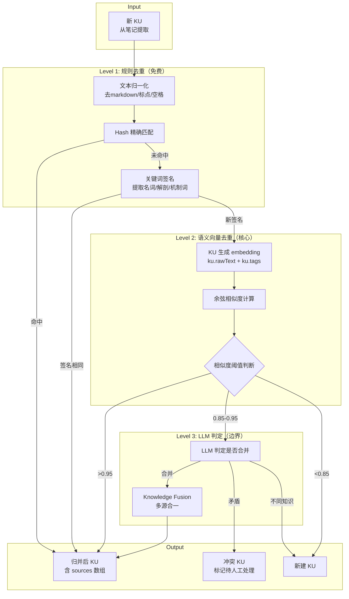
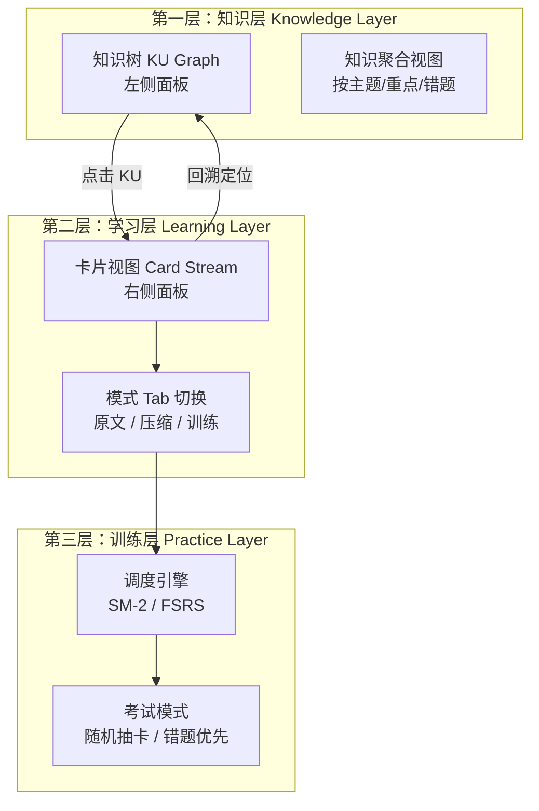
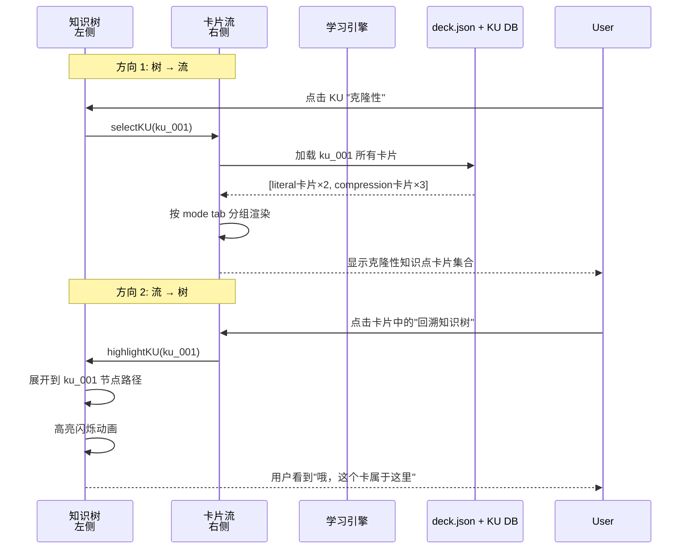
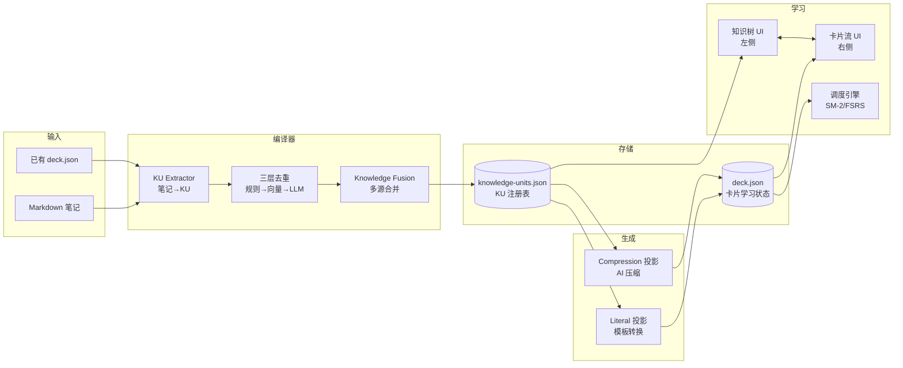

# 实体解析系统 + 三层 UI 设计

## 你现在在做的事

```
不是卡片去重
→ 是跨笔记知识单元的实体解析（Entity Resolution）

不是卡片管理器
→ 是学习操作系统（Learning OS）
```

---

## 一、三层去重架构（Entity Resolution）



---

## 二、四类重复 + 处理策略

| 类型 | 定义 | 示例 | 检测方法 | 处理 |
|------|------|------|---------|------|
| **完全重复** | 文本完全相同 | "颈动脉体是外周化学感受器" ×2 | Hash 精确匹配 | 自动合并 |
| **语义重复** | 表述不同但语义相同 | "外周化学感受器主要调节呼吸" vs "颈动脉体负责呼吸调节" | Embedding + LLM | 自动/半自动合并 |
| **结构变体** | 结构不同但知识相同 | 表格 vs 列表 vs cloze | 关键词签名 | 合并到同一 KU |
| **局部重叠** | 部分知识相同 | 颈动脉体 vs 主动脉体（都是化学感受器） | 低相似度检测 | 标记关联，不合并 |

---

## 三、核心数据结构：多源 KU

```typescript
// 合并后的 KU — 多源合一
export interface MergedKnowledgeUnit {
  id: KUId;                         // ku_a1b2c3d4

  // 多源引用（关键新增）
  sources: SourceRef[];             // 所有来源笔记的引用

  // 规范表达（canonical form）
  canonical: {
    text: string;                   // 最优表达
    confidence: number;             // 0-1 合并置信度
  };

  // 原始文本（多个来源的原始表述）
  rawVariants: Array<{
    text: string;
    sourceNote: string;
    blockId: string;
  }>;

  // 投影
  projections: {
    literal?: Projection;
    compression?: Projection;
  };

  // 关联关系
  relations: Array<{
    targetKuId: KUId;
    relation: "prerequisite" | "part-of" | "contrast" | "similar";
  }>;

  // 去重元数据
  dedup: {
    signature: string;              // 关键词签名
    embedding?: number[];           // 向量（可选持久化）
    mergeHistory: Array<{
      fromKuId: KUId;
      method: "exact" | "signature" | "vector" | "llm";
      timestamp: string;
    }>;
  };

  tags: string[];
  importance: number;
  createdAt: string;
  updatedAt: string;
}
```

---

## 四、冲突解决策略

### 冲突类型

| 冲突类型 | 示例 | 处理 |
|---------|------|------|
| 补充性差异 | "调呼吸" vs "调呼吸+心血管" | Union 合并，标注来源 |
| 角度差异 | "从结构描述" vs "从功能描述" | 保留为两个 projection |
| 观点矛盾 | "主要调呼吸" vs "主要调循环" | **不合并**，标记冲突 KU |

### 冲突 UI（类 Git merge）

```
┌──────────────────────────────────────┐
│ ⚠️ 检测到知识冲突                      │
│                                      │
│ 来源 A: 颈动脉体主要调节呼吸          │
│ 来源 B: 颈动脉体主要调节循环          │
│                                      │
│ ┌─ 请选择操作 ───────────────────┐   │
│ │ [保留 A]  [保留 B]  [合并]  [忽略]│ │
│ └────────────────────────────────┘   │
│                                      │
│ 或手动编辑规范文本:                   │
│ ┌────────────────────────────────┐   │
│ │ 颈动脉体主要调节呼吸            │   │
│ └────────────────────────────────┘   │
└──────────────────────────────────────┘
```

---

## 五、三层 UI 架构



---

## 六、主界面布局

```
┌─────────────────────────────────────────────────────────────┐
│  🔍 搜索知识单元...  [📖原文] [🧠压缩] [🎯训练]  ⚙️      │
├──────────────────────────────┬──────────────────────────────┤
│  📁 知识树                   │  🃏 卡片流                    │
│                              │                              │
│  📂 肿瘤学                   │  ┌─ KU: 克隆性 ──────────┐  │
│    ├─ 🟢 肿瘤概述            │  │                        │  │
│    │    ├─ 🟢 定义           │  │  📖 原文模式            │  │
│    │    ├─ 🔵 四大特点       │  │  ════════════════════   │  │
│    │    └─ 🔴 分类           │  │  🃏 cloze: 肿瘤性增生  │  │
│    ├─ 🔵 增殖机制            │  │    是{{c1::单克隆性}}   │  │
│    │    ├─ 🟢 克隆性         │  │                        │  │
│    │    └─ 🔴 与机体关系     │  │  ─── 掌握度 ████░░ 58% │  │
│    └─ 📁 临床意义             │  │                        │  │
│                              │  ├────────────────────────┤  │
│  [完整树] [按重点] [按错题]   │  │  🧠 压缩模式            │  │
│                              │  │  ════════════════════   │  │
│                              │  │  🃏 Q: 肿瘤性增生的     │  │
│                              │  │     核心特征？          │  │
│                              │  │  🃏 对比: 良性vs恶性   │  │
│                              │  └────────────────────────┘  │
│                              │                              │
│                              │  [上一张]  [翻转]  [下一张]   │
└──────────────────────────────┴──────────────────────────────┘
```

### 色彩编码

| 状态 | 颜色 | 含义 |
|------|------|------|
| 🟢 绿色 | 已掌握 | mastery > 80% |
| 🔵 蓝色 | 学习中 | 20% < mastery < 80% |
| ⚫ 灰色 | 未学习 | mastery = 0 |
| 🔴 红色 | 易错 | 错误率 > 40% |

---

## 七、关键交互：知识树 ↔ 卡片流双向绑定



---

## 八、三种视图 Tab

### 📖 原文模式（Literal Tab）

```
用途：复习笔记原意，高保真还原
卡片类型：cloze（保留原文挖空）
AI 参与度：无
适合场景：第一次复习、查漏补缺
```

### 🧠 压缩模式（Compression Tab）

```
用途：强化记忆，高效复习
卡片类型：QA、对比、机制、口诀
AI 参与度：高（压缩 + 重写）
适合场景：考前冲刺、快速刷题
```

### 🎯 训练模式（Training Tab）

```
用途：考试模拟，混合抽卡
卡片类型：随机混合（所有类型）
调度算法：SM-2/FSRS + 错题优先
AI 参与度：无（纯调度）
适合场景：日常复习、自测
```

---

## 九、错题驱动视图

```
┌──────────────────────────────────────────┐
│  📊 错题本 — 12 个易错 KU              │
│                                          │
│  ┌─ 易错 KU ─────────────────────────┐  │
│  │  🔴 肿瘤性增生 vs 非肿瘤性增生      │  │
│  │  错误率: 65% | 相关卡片: 4张       │  │
│  │  [集中训练] [回溯原文] [查看笔记]   │  │
│  └────────────────────────────────────┘  │
│                                          │
│  ┌─ 易错 KU ─────────────────────────┐  │
│  │  🔴 颈动脉体功能                    │  │
│  │  错误率: 42% | 相关卡片: 3张       │  │
│  │  [集中训练] [回溯原文] [查看笔记]   │  │
│  └────────────────────────────────────┘  │
└──────────────────────────────────────────┘
```

---

## 十、整体数据流（完整链路）



---

## 十一、相对于上次设计的增量变化

| 维度 | 上次设计 | 本次新增 |
|------|---------|---------|
| 去重 | 未设计 | **三层去重**：规则→向量→LLM |
| 合并 | 简单替换 | **Knowledge Fusion**：多源合一 + sources 数组 |
| 冲突处理 | 无 | **类 Git merge**：保留/合并/忽略/标记冲突 |
| UI 结构 | 卡片列表 | **知识树 + 卡片流** 双向绑定 |
| 视图 Tab | 无 | **原文/压缩/训练** 三种模式 Tab |
| 错题驱动 | 无 | **错题本视图**：按错误率聚合 KU |
| KU 数据结构 | 单源 | **多源**：sources[], rawVariants[], mergeHistory |

---

## 十二、实施路线图（4 个里程碑）

### Milestone 1：KU 基础设施 + 规则去重
- `models/knowledge-unit.ts` — 多源 KU 类型
- `resolver/ku-extractor.ts` — 笔记 → KU
- `resolver/ku-store.ts` — KU 持久化
- Level 1 规则去重（hash + 关键词签名）

### Milestone 2：三层 UI
- `ui/knowledgeTree.ts` — 左侧知识树组件
- `ui/cardStream.ts` — 右侧卡片流组件
- `ui/knowledgeUnitModal.ts` — KU 详情弹窗
- 原文/压缩/训练三种 Tab

### Milestone 3：AI 压缩 + 聊天弹窗
- `ai/provider.ts` + `ai/openai.ts` — API 客户端
- `ai/compression-service.ts` — 压缩生成
- `ui/aiChat.ts` — 聊天弹窗 + 设置面板
- Level 2 向量去重（embedding 索引）

### Milestone 4：高级能力
- Level 3 LLM 判定合并
- 冲突解决 UI
- 错题本视图
- 训练模式

---

## 十三、最核心的一句话

> **知识树负责"理解结构"，卡片流负责"训练记忆"——左脑右脑，各司其职。**
