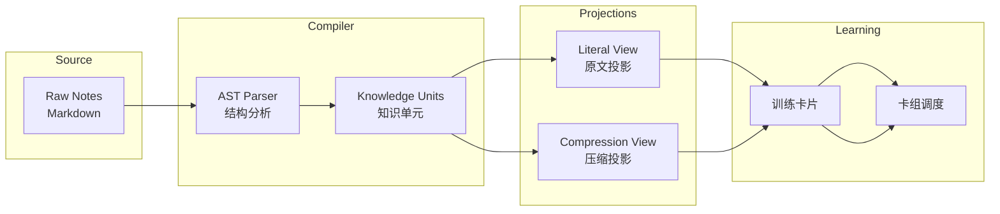
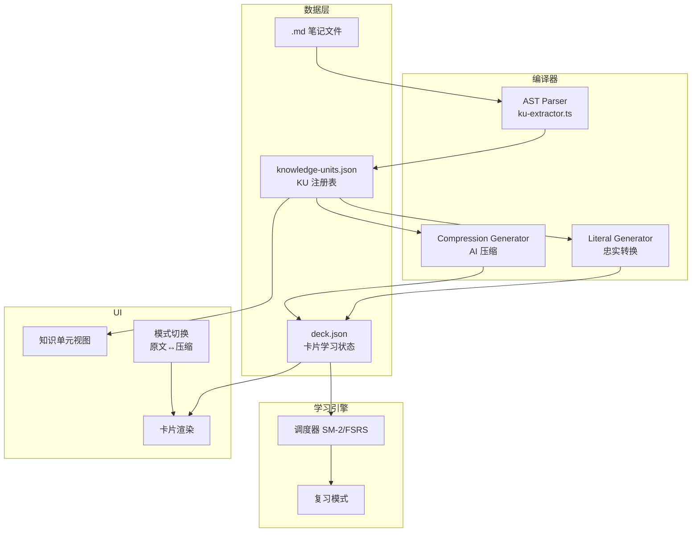

# Knowledge Unit 架构设计 — 学习编译器

## 核心思想

```
不是"卡片管理工具"，而是"学习信息编译器"
```



---

## 1. 数据模型（新增文件）

### `models/knowledge-unit.ts` — 知识单元

```typescript
// 知识单元 ID 格式: ku_{8位hex}
export type KUId = string;

// 源引用：从笔记的哪个块提取
export interface SourceRef {
  notePath: string;       // "path/to/note.md"
  blockId: string;        // 块锚点，如 "b12"
  lineStart: number;
  lineEnd: number;
}

// 知识单元 — 系统的真实实体
export interface KnowledgeUnit {
  id: KUId;
  source: SourceRef;
  rawText: string;          // 原始文本
  structure: KUStructure;   // 结构类型
  tags: string[];
  importance: number;       // 0.0 - 1.0，用户可调
  createdAt: string;        // ISO date
  updatedAt: string;
}

export type KUStructure =
  | "big-cloze"      // 西综大卡片 【看到啥】→【想到啥】
  | "small-vocab"    // 英语小卡片 word: def
  | "table"          // 表格行
  | "paragraph";     // 自由段落（未匹配的普通文本）

// 卡片的类型
export type CardType =
  | "cloze"          // 挖空：颈动脉体是{{c1::外周化学感受器}}
  | "qa"             // 问答：Q: 功能? A: ...
  | "judgement"      // 判断：颈动脉体主要调节循环 → 错误
  | "mnemonic";      // 助记：只监不吃，调呼吸
```

### `models/projection.ts` — 投影

```typescript
// 投影 — 同一个 KU 在不同模式下的表达
export interface Projection {
  kuId: KUId;
  mode: "literal" | "compression";
  cards: CardFace[];
  version: number;         // 重新生成时递增，旧卡片可废弃
  generatedAt: string;
}

// 卡片面 — 一张卡的正反面
export interface CardFace {
  cardId: string;         // "card_{12位hex}"
  type: CardType;
  front: string;          // 正面文本（含 cloze 标记）
  back: string;           // 背面文本（完整答案）
  clozeSegments?: Array<{
    hint: string;
    answer: string;
  }>;
  // 关联到 deck.json 中具体 word 的 key
  wordKey: string;
}
```

---

## 2. 对 deck.json 的扩展（最小化改动）

### `models/card.ts` — WordEntry 扩展

在现有 [`models/card.ts:24`](models/card.ts:24) `WordEntry` 中新增 2 个字段：

```typescript
export interface WordEntry {
  // ... 所有现有字段 (meaning, deck, state, ease, interval, next, history, cloze, mnemonic, priority, source)

  // ─── 新增 ───

  /** 关联的知识单元 ID */
  kuId?: KUId;

  /** 该卡片来自哪种投影模式 */
  projectionMode?: "literal" | "compression";

  /** 投影版本号，旧版本可被清理 */
  projectionVersion?: number;
}
```

### 新增数据文件

```
system/
  deck.json              # 不变 — 所有卡片的学习状态
  knowledge-units.json   # 新增 — KU 注册表
```

### `knowledge-units.json` 结构

```json
{
  "version": 1,
  "knowledgeUnits": {
    "ku_a1b2c3d4": {
      "id": "ku_a1b2c3d4",
      "source": {
        "notePath": "西综/生理学/呼吸.md",
        "blockId": "b12",
        "lineStart": 45,
        "lineEnd": 48
      },
      "rawText": "颈动脉体是外周化学感受器，主要调节呼吸",
      "structure": "small-vocab",
      "tags": ["呼吸调节", "化学感受器"],
      "importance": 0.92,
      "createdAt": "2026-06-22",
      "updatedAt": "2026-06-22"
    }
  },
  "projections": {
    "ku_a1b2c3d4": {
      "literal": {
        "version": 1,
        "generatedAt": "2026-06-22"
      },
      "compression": {
        "version": 2,
        "generatedAt": "2026-06-22"
      }
    }
  }
}
```

---

## 3. 系统架构总览



---

## 4. 两种模式的具体实现

### 4.1 忠于原文模式（Literal Mode）

**AI 角色：极少**

| 步骤 | 操作 | 谁做 |
|------|------|------|
| 1 | 解析笔记结构 → 分割为 KUs | AST Parser |
| 2 | 每个 KU → 1 张原文卡片（cloze/qa） | 模板引擎 |
| 3 | AI 仅辅助：标记重点词 → 挖空位置 | AI（可选） |
| 4 | 写入 deck.json | 插件 |

**卡片生成规则：**

```typescript
// 原文 KU "颈动脉体是外周化学感受器，主要调节呼吸"

// → Literal projection cards:
[
  {
    type: "cloze",
    front: "颈动脉体是{{c1::外周化学感受器}}，主要调节{{c2::呼吸}}",
    back: "颈动脉体是外周化学感受器，主要调节呼吸"
  }
]
```

### 4.2 压缩模式（Compression Mode）

**AI 角色：核心**

```typescript
// 用户发送笔记 → AI 处理流程:

// 输入 prompt（约 600 tokens）:
`
你是医学学习助手。对以下知识点生成压缩卡片：

原文：颈动脉体是外周化学感受器，主要调节呼吸
结构：小卡片

要求返回 JSON：
{
  "compressed": "压缩后的一句话总结",
  "cards": [
    { "type": "qa", "front": "...", "back": "..." },
    { "type": "mnemonic", "front": "...", "back": "..." }
  ],
  "cloze": [
    { "hint": "提示", "answer": "答案" }
  ]
}
`

// AI 返回 JSON（约 300 tokens）:
{
  "compressed": "颈动脉体：高血供不耗氧 → 化学监测，调节呼吸",
  "cards": [
    {
      "type": "qa",
      "front": "颈动脉体的功能是什么？",
      "back": "外周化学感受器，主要调节呼吸"
    },
    {
      "type": "mnemonic",
      "front": "颈动脉体记忆口诀",
      "back": "只监不吃，调呼吸"
    }
  ],
  "cloze": [
    { "hint": "颈动脉体是...", "answer": "外周化学感受器" },
    { "hint": "主要调节...", "answer": "呼吸" }
  ]
}
```

---

## 5. 同一 KU 在 deck.json 中的存储

```json
{
  "words": {
    // ── Literal 卡片 ──
    "颈动脉体_化学感受器_lit": {
      "meaning": "颈动脉体是外周化学感受器，主要调节呼吸",
      "deck": ["生理学/呼吸"],
      "state": "review",
      "ease": 250,
      "interval": 5,
      "next": "2026-06-27",
      "history": [
        { "date": "2026-06-22", "mode": "review", "result": "good" }
      ],
      "cloze": [
        { "hint": "颈动脉体是...", "answer": "外周化学感受器" },
        { "hint": "主要调节...", "answer": "呼吸" }
      ],
      "kuId": "ku_a1b2c3d4",
      "projectionMode": "literal",
      "projectionVersion": 1,
      "source": "literal"
    },

    // ── Compression 卡片 ──
    "颈动脉体功能_cmp": {
      "meaning": "Q: 颈动脉体功能？ A: 外周化学感受器，调节呼吸\n助记：只监不吃，调呼吸",
      "deck": ["生理学/呼吸"],
      "state": "new",
      "ease": 250,
      "interval": 0,
      "next": null,
      "history": [],
      "cloze": [
        { "hint": "颈动脉体是...", "answer": "外周化学感受器" }
      ],
      "kuId": "ku_a1b2c3d4",
      "projectionMode": "compression",
      "projectionVersion": 1,
      "source": "ai"
    }
  }
}
```

---

## 6. 核心流程：从笔记到卡片

```mermaid
sequenceDiagram
    participant Note as 笔记文件
    participant Parser as KU Extractor
    participant KUDB as knowledge-units.json
    participant Deck as deck.json
    participant UI as 用户界面

    Note->>Parser: 保存笔记或手动触发

    Parser->>Parser: 1. AST 分析<br/>分割段落/列表/标题
    Parser->>Parser: 2. 生成 KU（含 sourceRef）
    Parser->>Parser: 3. 对比已有 KU（去重）

    Parser->>KUDB: 写入新 KU

    alt 忠于原文模式
        Parser->>Deck: 直接写 Literal 卡片<br/>模板化转换
    else 压缩模式（AI）
        Parser->>AI: 发送 KU + 压缩 prompt
        AI-->>Parser: 返回压缩卡片 JSON
        Parser->>Deck: 写入 Compression 卡片
    end

    Deck-->>UI: 刷新卡片列表
    UI-->>User: 显示新的知识单元 + 卡片
```

---

## 7. 掌握度统合

### 以 KU 为单位的掌握度计算

```typescript
function computeKUMastery(
  kuId: KUId,
  words: Record<string, WordEntry>
): MasteryResult {
  // 找到所有关联此 KU 的卡片
  const relatedCards = Object.entries(words)
    .filter(([_, entry]) => entry.kuId === kuId);

  if (relatedCards.length === 0) {
    return { mastery: 0, ease: 250, interval: 0, successRate: 0 };
  }

  // 聚合所有卡片的掌握度
  // Literal 卡片权重 0.6（基础）
  // Compression 卡片权重 0.4（强化）
  let totalMastery = 0;
  for (const [_, entry] of relatedCards) {
    const weight = entry.projectionMode === "literal" ? 0.6 : 0.4;
    const cardMastery = calcCardMastery(entry);
    totalMastery += cardMastery * weight;
  }

  return totalMastery;
}
```

---

## 8. UI 关键交互

### 知识单元视图（取代纯卡片列表）

```
┌──────────────────────────────────────┐
│ 📚 生理学/呼吸 — 3 个知识单元        │
├──────────────────────────────────────┤
│                                      │
│ ┌─ 知识单元 1 ──────────────────┐   │
│ │ 颈动脉体是外周化学感受器，      │   │
│ │ 主要调节呼吸                    │   │
│ │                                 │   │
│ │ [📖 原文]  [🧠 压缩]  [📊 掌握度]│   │
│ │                                 │   │
│ │ 原文卡片: 2张  |  掌握度 75%    │   │
│ │ 压缩卡片: 1张  |  掌握度 30%    │   │
│ │ ───────────────────────────     │   │
│ │ 总体掌握度: ████████░░ 58%     │   │
│ └─────────────────────────────────┘   │
│                                      │
│ ┌─ 知识单元 2 ──────────────────┐   │
│ │ ...                            │   │
│ └─────────────────────────────────┘   │
└──────────────────────────────────────┘
```

### 模式切换

```
[📖 忠于原文] ⇄ [🧠 压缩模式]
     ↓                ↓
显示原始笔记格式      显示 AI 优化卡片
不改语义             可能重写
学习状态独立          学习状态独立
但掌握度共享         但掌握度共享
```

---

## 9. 新增文件清单

| 文件 | 用途 |
|------|------|
| `models/knowledge-unit.ts` | KU、Projection、CardFace 类型定义 |
| `resolver/ku-extractor.ts` | 笔记 → KU 解析器（AST 分析 + 分割） |
| `resolver/ku-store.ts` | knowledge-units.json 的读写封装 |
| `ai/compression-service.ts` | AI 压缩模式服务（调用 LLM） |
| `ui/knowledgeUnitView.ts` | 知识单元视图组件 |
| `ui/knowledgeUnitModal.ts` | 知识单元详情弹窗（含模式切换） |

### 修改文件清单

| 文件 | 改动 |
|------|------|
| `models/card.ts` | WordEntry 新增 `kuId`, `projectionMode`, `projectionVersion` |
| `main.ts` | 注册 KU 相关命令和设置项 |
| `ui/quickView.ts` | 新增 KU 入口 |
| `resolver/index.ts` | 导出 KU 相关模块 |
| `styles.css` | KU 视图样式 |

---

## 10. 实施步骤（分阶段）

### Phase 1：KU 基础设施
1. `models/knowledge-unit.ts` — 类型定义
2. `resolver/ku-extractor.ts` — 笔记 → KU 解析
3. `resolver/ku-store.ts` — KU 持久化
4. 扩展 `models/card.ts` WordEntry

### Phase 2：忠于原文模式
5. `ui/knowledgeUnitView.ts` — KU 列表视图
6. Literal 卡片生成（模板化，无 AI）
7. 模式切换 UI

### Phase 3：AI 压缩模式
8. `ai/provider.ts` + `ai/openai.ts` — API 客户端
9. `ai/compression-service.ts` — 压缩生成
10. 预览 + 应用机制

### Phase 4：AI 聊天弹窗
11. `ui/aiChat.ts` — 聊天弹窗
12. 设置面板双入口
13. 对话持久化
