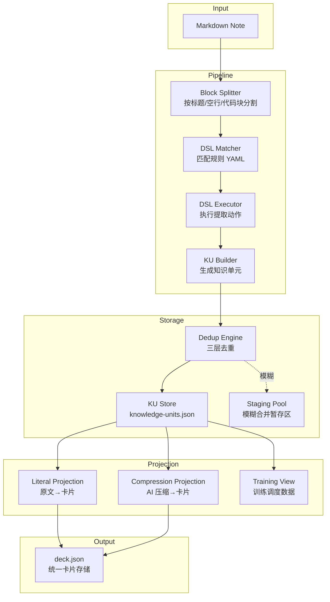
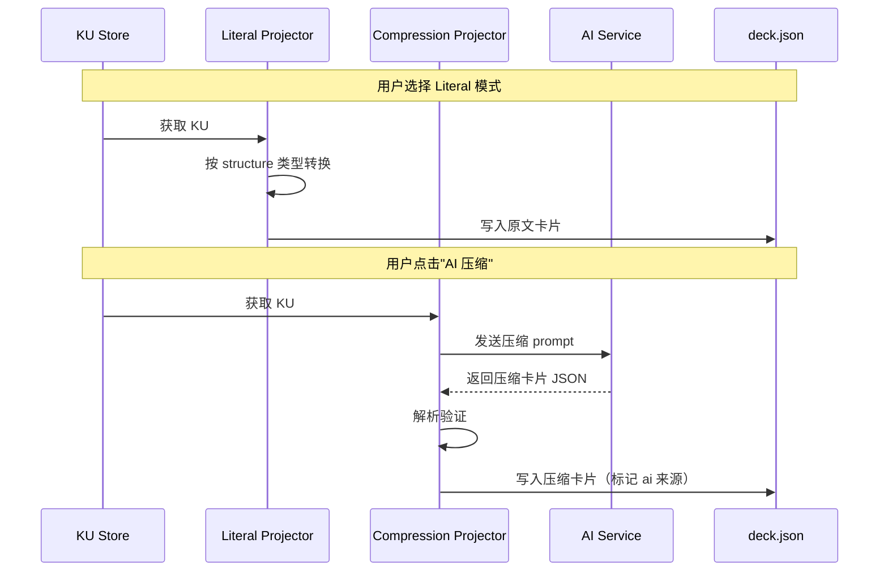
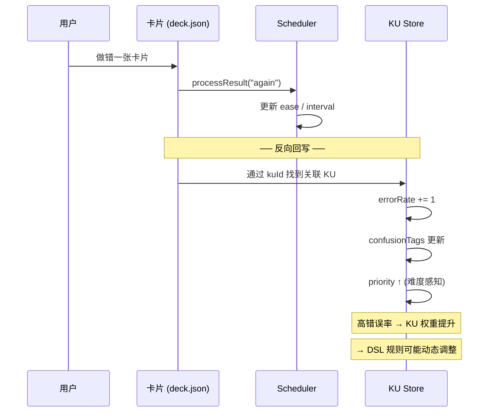
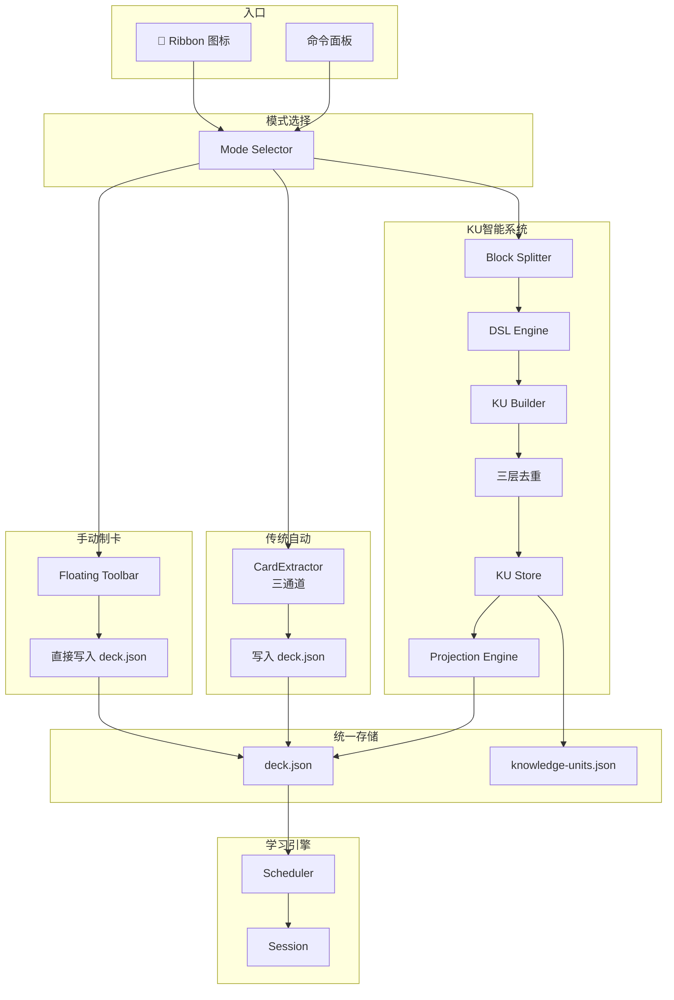

# 🧠 RemiFocus 三模式知识编译器 — 架构设计

> 版本: v1.1（已整合评审反馈）
> 日期: 2026-06-22
> 基于用户建议重构：从"笔记转卡片工具"升级为"基于 DSL 的知识编译器 + KU 知识操作系统"

---

## 📋 目录

1. [现状分析](#1-现状分析)
2. [整体架构总览](#2-整体架构总览)
3. [三模式定位与数据流](#3-三模式定位与数据流)
4. [DSL 规则引擎设计](#4-dsl-规则引擎设计)
5. [Projection Engine 设计](#5-projection-engine-设计)
6. [Pipeline 执行流程](#6-pipeline-执行流程)
7. [Unified Deck Schema](#7-unified-deck-schema)
8. [统一入口 UI 设计](#8-统一入口-ui-设计)
9. [关键补充系统（评审反馈整合）](#9-关键补充系统评审反馈整合)
10. [文件变更清单](#10-文件变更清单)
11. [分阶段实施计划](#11-分阶段实施计划)

---

## 1. 现状分析

### 现有系统架构（AS-IS）

```text
┌─ Markdown Notes ──────────────────────────────┐
│                                                 │
│   ┌──────────────────────┐                      │
│   │ CardExtractor        │ ← 传统自动识别引擎    │
│   │ (三通道: 大卡/小卡/表) │                      │
│   └──────────┬───────────┘                      │
│              ↓                                  │
│   ┌──────────────────────┐                      │
│   │    deck.json         │ ← 唯一卡片状态源      │
│   │  (WordEntry 格式)     │                      │
│   └──────────┬───────────┘                      │
│              ↓                                  │
│   ┌──────────────────────┐                      │
│   │  Scheduler(多算法)    │ → Session/复习       │
│   └──────────────────────┘                      │
│                                                 │
│   📌 已有但未集成:                              │
│   • KUStore / KUDatabase  (已建类型)            │
│   • KUExtractor          (已建, 但未接入DSL)   │
│   • KUDedupEngine        (三层去重)            │
│   • KUStabilityGuard     (稳定性控制)          │
│   • AIService            (AI服务, 独立使用)    │
└─────────────────────────────────────────────────┘
```

### 已存在的关键资产

| 模块 | 状态 | 说明 |
|------|------|------|
| [`models/knowledge-unit.ts`](models/knowledge-unit.ts) | ✅ 已有 | KU 类型定义，含 `canonical`, `sources`, `relations`, `stability`, `dedup` |
| [`models/projection.ts`](models/projection.ts) | ✅ 已有 | Projection 类型，含 `literal` / `compression` 模式 |
| [`models/card.ts:41-47`](models/card.ts:41) | ✅ 已有 | `WordEntry` 已扩展 `kuId`, `projectionMode`, `projectionVersion` |
| [`resolver/ku-extractor.ts`](resolver/ku-extractor.ts) | ✅ 已有 | 从 Markdown 提取 KU（硬编码规则，非 DSL） |
| [`resolver/ku-store.ts`](resolver/ku-store.ts) | ✅ 已有 | JSON 文件持久化 |
| [`storage/ku-database.ts`](storage/ku-database.ts) | ✅ 已有 | IndexedDB 实现 |
| [`resolver/ku-dedup.ts`](resolver/ku-dedup.ts) | ✅ 已有 | 三层去重引擎（规则+向量+LLM） |
| [`resolver/ku-stability.ts`](resolver/ku-stability.ts) | ✅ 已有 | 稳定性守卫 |
| [`resolver/cardExtractor.ts`](resolver/cardExtractor.ts) | ✅ 已有 | 传统自动识别（三通道） |
| [`ai/`](ai/) | ✅ 已有 | AI 服务、压缩生成、OpenAI 客户端 |
| DSL 规则引擎 | ❌ 缺失 | 核心缺失部分 |
| Projection Engine | ❌ 缺失 | 仅有类型定义，无实现 |
| Pipeline 串联 | ❌ 缺失 | 未将 KU → Projection → Card 串联 |
| 三模式统一 UI | ❌ 缺失 | 无统一入口选择模式 |

### 关键缺失分析

> **核心问题：现有 KU 层是"被动提取"而非"主动编译"**
>
> - KUExtractor 用硬编码规则决定结构（如 `【看到啥】` → big-cloze）
> - 没有可配置的 DSL 规则系统
> - KU 生成后没有串联到 Projection Engine
> - 三种模式（手动/传统/KU）各自独立，没有统一入口

---

## 2. 整体架构总览

### 三层架构

```text
           📥 Markdown 笔记
                │
    ┌───────────┼───────────┐
    ↓           ↓           ↓
 ┌──────┐ ┌─────────┐ ┌──────────┐
 │ 手动  │ │ 传统自动  │ │ KU/DSL   │
 │ 制卡  │ │ 识别     │ │ 智能系统  │
 └──┬───┘ └────┬────┘ └────┬─────┘
    │          │           │
    ↓          ↓           ↓
 ┌─────────────────────────────┐
 │     Unified Deck Schema      │ ← 统一卡片存储
 │       deck.json 扩展版        │
 └──────────────┬──────────────┘
                ↓
 ┌─────────────────────────────┐
 │     Scheduler + Session      │ ← 现有学习引擎完全复用
 └─────────────────────────────┘
```

### KU/DSL 系统内部架构（核心新增）



---

## 3. 三模式定位与数据流

### 模式对比

| 维度 | 🧱 手动制卡 | ⚙️ 传统自动识别 | 🧠 KU/DSL 系统 |
|------|-----------|--------------|--------------|
| **本质** | 控制 | 速度 | 智能结构 |
| **用户心智模型** | "像 Notion 一样自由" | "像 Anki 一样快速" | "像学习操作系统一样智能" |
| **触发方式** | 用户手动添加 | 保存笔记自动扫描 | 保存笔记自动编译 |
| **提取引擎** | 无（用户自填） | [`cardExtractor.ts`](resolver/cardExtractor.ts) | DSL Matcher + Executor |
| **中间层** | 无 | 无 | KU（知识原子） |
| **去重** | 无（手动控制） | 按 word key 去重 | 三层语义去重 |
| **卡片生成** | 用户直接写数据 | 硬编码模板 | Projection Engine |
| **AI 角色** | 无 | 可选（AI 聊天） | 核心（压缩 + 模糊判定） |
| **适用场景** | 精细卡片/考试重点 | 简单笔记/快速制卡 | 复杂笔记/知识图谱 |
| **学习成本** | 低 | 低 | 中（需理解 DSL 概念） |

### 数据流对比

```text
🧱 手动制卡:
  用户输入 → FloatingToolbar → deck.json

⚙️ 传统自动识别:
  Note save → CardExtractor.extract() → deck.json

🧠 KU/DSL 系统:
  Note save → BlockSplitter → DSL Matcher → Extractor
       → KU Builder → Dedup Engine → KU Store
       → Projection Engine → deck.json
```

### 降级路径（优雅降级）

```text
默认 → 传统自动识别（兼容现有用户习惯）
      ↓ 用户点击"升级"
  进入 KU/DSL 模式
      ↓ 高级用户
  自定义 DSL 规则
```

---

## 4. DSL 规则引擎设计

### 4.1 核心概念

> DSL 不是代码，是**可读规则**。用户通过 YAML 定义"从笔记的什么模式提取什么知识"。

### 4.2 DSL 规则格式

```yaml
# ─── 词汇卡规则 ───
rule: vocab_card
description: "提取高亮标记的词汇"
match:
  - pattern: "- ==.*==:"
    type: regex
action:
  extract:
    front: bold_word       # ==xxx== 中的内容
    phonetic: slash_content # /xxx/ 中的内容
    meaning: after_colon   # 冒号后的内容
output:
  structure: small-vocab
  tags: [vocabulary]

# ─── 规则卡规则 ───
rule: rule_card
description: "提取【看到啥】→【想到啥】结构的规则卡片"
match:
  - heading_contains: "看到啥"
extract:
  concept: heading
  core: section("想到啥")
  wrong: section("别选啥")
  mnemonic: section("记住啥")
output:
  structure: big-cloze
  tags: [rule]

# ─── 表格对比规则 ───
rule: comparison_card
description: "将对比表格按行提取为卡片"
match:
  - type: table
action:
  split_rows: true
  map_columns:
    left: A
    right: B
output:
  structure: table
  tags: [comparison]
```

### 4.3 DSL 规则类型定义

```typescript
// src/core/dsl/types.ts — DSL 类型定义（新建）

export type DSLMatchType =
  | "regex"           // 正则匹配行
  | "heading"         // 标题匹配
  | "heading_contains" // 标题包含关键词
  | "block_type"      // 块类型（table/code/quote）
  | "tag";            // 标签匹配

export interface DSLMatchRule {
  type: DSLMatchType;
  pattern?: string;       // 正则表达式
  heading_contains?: string; // 标题包含
  heading_regex?: string;    // 标题正则
}

export interface DSLExtractField {
  source: "heading" | "bold_word" | "highlight_word"
        | "after_colon" | "slash_content" | "section"
        | "table_cell" | "line_content" | "frontmatter";
  section_name?: string;   // section("想到啥") 中的参数
  column_index?: number;   // 表格列索引
  column_name?: string;    // 表格列名
}

export interface DSLAction {
  extract: Record<string, DSLExtractField>;
  split_rows?: boolean;     // 表格按行拆分
  map_columns?: Record<string, string>; // 列映射
}

export interface DSLOutputConfig {
  structure: string;        // big-cloze | small-vocab | table | paragraph
  tags?: string[];
}

export interface DSLRule {
  id: string;
  rule: string;
  description?: string;
  enabled: boolean;
  builtin: boolean;
  match: DSLMatchRule[];
  extract?: DSLExtractField[];
  action?: DSLAction;
  output: DSLOutputConfig;
}
```

### 4.4 DSL 引擎组件

| 组件 | 文件 | 职责 |
|------|------|------|
| [`parser.ts`](src/core/dsl/parser.ts) | **新建** | 解析 YAML 规则文件为 `DSLRule[]` |
| [`matcher.ts`](src/core/dsl/matcher.ts) | **新建** | 对笔记块逐一匹配规则，返回匹配结果 |
| [`executor.ts`](src/core/dsl/executor.ts) | **新建** | 执行提取动作，生成 `ExtractedKU` |
| [`registry.ts`](src/core/dsl/registry.ts) | **新建** | 管理内置规则 + 用户自定义规则 |

### 4.5 DSL 执行流程

```text
Markdown Block (单个段落/列表/表格)
     │
     ▼
┌──────────────────────┐
│  DSL Matcher          │ ← 遍历所有启用的 DSLRule
│                       │
│  遍历规则列表:          │
│  ┌────────────────┐   │
│  │ Rule 1: regex?  │──→ 匹配 → executor
│  │ Rule 2: heading? │──→ 匹配 → executor
│  │ Rule 3: table?   │──→ 匹配 → executor
│  │ ...              │
│  └────────────────┘   │
└──────────────────────┘
     │
     ▼ (匹配成功的规则)
┌──────────────────────┐
│  DSL Executor         │ ← 按规则定义的提取字段执行
│                       │
│  extract.front =      │
│    extractHighlight() │
│  extract.meaning =    │
│    extractAfterColon()│
│                       │
│  → 返回 ExtractedKU   │
└──────────────────────┘
```

### 4.6 内置规则（开箱即用）

系统预置 6 条内置 DSL 规则，覆盖最常见笔记模式：

| 规则名 | 匹配模式 | 提取内容 | 输出结构 |
|--------|---------|---------|---------|
| `vocab_highlight` | `- ==word==: meaning` | 高亮词 + 释义 | `small-vocab` |
| `vocab_bold` | `- **word**: meaning` | 加粗词 + 释义 | `small-vocab` |
| `rule_card` | 标题含 `【看到啥】` | 概念+核心+错误+助记 | `big-cloze` |
| `comparison_table` | Markdown 表格 | 按行拆分对比项 | `table` |
| `simple_list` | `- term: definition` | 术语 + 定义 | `small-vocab` |
| `paragraph` | 普通段落（兜底） | 整段文本 | `paragraph` |

### 4.7 用户自定义规则存储

```yaml
# system/dsl-rules.yaml — 用户 DSL 规则文件（新建）
# 存储在 .obsidian/plugins/remifocus/system/

version: 1
rules:
  # 用户可在此添加自定义规则
  # 优先级：自定义规则 > 内置规则
```

---

## 5. Projection Engine 设计

### 5.1 核心思想

> KU 不直接变卡片，KU → 多种视图（Projection）

### 5.2 Projection 类型

| 类型 | 模式 | AI 角色 | 说明 |
|------|------|---------|------|
| **Literal View** | `literal` | 极少 | 保留原结构 + 挖空，模板化转换 |
| **Compression View** | `compression` | 核心 | AI 压缩摘要 → QA/助记卡片 |
| **Training View** | `training` | 无 | FSRS/SM2 调度数据 |

### 5.3 Projection Engine 组件

```typescript
// src/core/projection/types.ts — 扩展已有投影类型

export type ProjectionMode = "literal" | "compression" | "training";

export interface ProjectionJob {
  ku: KnowledgeUnit;
  mode: ProjectionMode;
  options?: {
    clozeCount?: number;      // 挖空数
    preserveStructure?: boolean; // 保留原结构
    aiModel?: string;          // AI 模型
  };
}

export interface ProjectionResult {
  kuId: KUId;
  mode: ProjectionMode;
  version: number;
  cards: CardFace[];
  generatedAt: string;
}
```

### 5.4 Literal Projection（原文投影）

```typescript
// src/core/projection/literal.ts — 原文投影生成器

class LiteralProjector {
  /**
   * 将 KU 忠实转换为原文卡片
   * 
   * 规则:
   * - big-cloze → cloze 卡片（保留【看到啥】结构）
   * - small-vocab → QA 卡片（word → meaning）
   * - table → 按行拆分 cloze
   * - paragraph → 自动挖空
   */
  project(ku: KnowledgeUnit): CardFace[] {
    switch (ku.structure) {
      case "big-cloze":
        return this.bigClozeToCards(ku);
      case "small-vocab":
        return this.smallVocabToCards(ku);
      case "table":
        return this.tableToCards(ku);
      case "paragraph":
        return this.paragraphToCards(ku);
    }
  }
}
```

### 5.5 Compression Projection（压缩投影）

```typescript
// src/core/projection/compression.ts — AI 压缩投影生成器

class CompressionProjector {
  /**
   * 通过 AI 将 KU 压缩为学习卡片
   * 
   * 流程:
   * 1. 构建 prompt（含 KU 原文 + 结构信息）
   * 2. 调用 AI 生成压缩卡片 JSON
   * 3. 解析并验证返回结果
   * 4. 返回 CardFace[]
   */
  async project(ku: KnowledgeUnit): Promise<CardFace[]> {
    // 1. 构建 prompt
    const prompt = this.buildPrompt(ku);
    
    // 2. 调用 AI
    const response = await this.aiService.compress(prompt);
    
    // 3. 解析结果
    return this.parseResponse(response, ku);
  }
}
```

### 5.6 Projection 执行流程



---

## 6. Pipeline 执行流程

### 6.1 完整数据流

```text
1. 用户保存笔记 (vault.on("modify"))
         │
2. Block Splitter 按结构分割
   ┌──────────────┐
   │ 标题块        │
   │ 列表块        │
   │ 表格块        │
   │ 段落块        │
   └──────┬───────┘
          │
3. DSL Matcher 对每个块匹配规则
   ┌──────────────┐
   │ vocab_highlight → 匹配! │
   │ rule_card → 不匹配     │
   │ comparison_table → 匹配!│
   │ paragraph → 兜底匹配   │
   └──────┬───────┘
          │
4. DSL Executor 提取数据 → ExtractedKU
          │
5. KU Builder → 生成 KnowledgeUnit
          │
6. Dedup Engine 三层去重
   ┌──────────────┐
   │ Level1: exact │ → 合并 source
   │ Level2: vector│ → 暂存区
   │ Level3: LLM   │ → 人工/自动判定
   └──────┬───────┘
          │
7. KU Store 持久化
          │
8. Projection Engine 生成卡片
   ┌──────────────┐
   │ Literal      │ → deck.json
   │ Compression  │ → deck.json (需AI)
   └──────┬───────┘
          │
9. UI 刷新 → 知识树 / 卡片流
```

### 6.2 Pipeline 组件文件

| 组件 | 文件 | 职责 |
|------|------|------|
| [`note-processor.ts`](src/pipeline/note-processor.ts) | **新建** | 编排完整流水线（split → dsl → ku → projection） |
| [`block-splitter.ts`](src/pipeline/block-splitter.ts) | **新建** | 按标题/空行/代码块分割笔记为独立块 |
| [`ku-builder.ts`](src/pipeline/ku-builder.ts) | **新建** | 将 ExtractedKU 组装为完整 KnowledgeUnit |

### 6.3 NoteProcessor 编排逻辑

```typescript
// src/pipeline/note-processor.ts — 流水线编排器

class NoteProcessor {
  async process(notePath: string, content: string): Promise<ProcessResult> {
    // Step 1: 分割块
    const blocks = await this.blockSplitter.split(content);
    
    // Step 2: DSL 匹配 + 提取
    const extractedKUs: ExtractedKU[] = [];
    for (const block of blocks) {
      const matchedRule = this.dslMatcher.match(block);
      if (matchedRule) {
        const extracted = this.dslExecutor.execute(block, matchedRule);
        extractedKUs.push(extracted);
      }
    }
    
    // Step 3: 构建 KU + 去重
    const newKUs: KnowledgeUnit[] = [];
    for (const extracted of extractedKUs) {
      const action = await this.dedupEngine.deduplicate(
        extracted.rawText, notePath, extracted.source.blockId
      );
      
      if (action.type === "new_ku") {
        const ku = this.kuBuilder.build(extracted);
        newKUs.push(ku);
      } else {
        // 合并到已有 KU
        await this.handleMerge(action, extracted);
      }
    }
    
    // Step 4: 持久化 KU
    for (const ku of newKUs) {
      await this.kuStore.put(ku);
    }
    
    // Step 5: 生成投影 → deck.json
    const allAffectedKUs = [...newKUs, ...this.getMergedKUs()];
    for (const ku of allAffectedKUs) {
      const cards = await this.projectionEngine.project(ku, "literal");
      await this.syncToDeck(ku, cards);
    }
    
    return { newKUs, mergedCount: this.mergedCount };
  }
}
```

---

## 7. Unified Deck Schema

### 7.1 统一数据结构

> 让 Manual / Classic / KU 三种模式的卡片写入**同一个 `deck.json`**，保持向后完全兼容。

### 7.2 现有 schema（保持不变）

[`models/card.ts:24`](models/card.ts:24) 的 `WordEntry` 已包含所有必要字段：

```typescript
interface WordEntry {
  meaning: string;
  deck: string[];
  state: WordState;
  ease: number;
  interval: number;
  next: string | null;
  history: HistoryEntry[];
  cloze?: ClozeSegment[];
  mnemonic?: string;
  priority?: number;        // 1=手动制卡, 0=自动
  source?: string;          // 'manual' | 'auto' | 'ku-literal' | 'ku-compression'
  
  // KU 关联（已存在）
  kuId?: string;
  projectionMode?: "literal" | "compression";
  projectionVersion?: number;
}
```

### 7.3 三种模式的卡片标记规则

```text
🧱 手动制卡:
  source: "manual"
  priority: 1
  kuId: undefined

⚙️ 传统自动识别:
  source: "auto"
  priority: 0
  kuId: undefined

🧠 KU Literal 投影:
  source: "ku-literal"
  priority: 0
  kuId: "ku_xxxx"
  projectionMode: "literal"
  projectionVersion: 1

🧠 KU Compression 投影:
  source: "ku-compression"
  priority: 0
  kuId: "ku_xxxx"
  projectionMode: "compression"
  projectionVersion: 1
```

### 7.4 KU 掌握度聚合计算

```typescript
// 以 KU 为单位聚合多张卡片的掌握度
function computeKUMastery(
  kuId: string,
  words: Record<string, WordEntry>
): MasteryResult {
  const relatedCards = Object.entries(words)
    .filter(([_, entry]) => entry.kuId === kuId);
  
  if (relatedCards.length === 0) {
    return { mastery: 0, ease: 250, interval: 0, successRate: 0 };
  }
  
  // Literal 卡片权重 0.6（基础）
  // Compression 卡片权重 0.4（强化）
  let totalMastery = 0;
  for (const [_, entry] of relatedCards) {
    const weight = entry.projectionMode === "literal" ? 0.6 : 0.4;
    const cardMastery = calcCardMastery(entry);
    totalMastery += cardMastery * weight;
  }
  
  return totalMastery;
}
```

---

## 8. 关键补充系统（评审反馈整合）

> 以下 4 个系统是架构评审中识别出的关键缺口，已在 v1.1 版本中补充。
> 评审核心原则：**所有智能必须收敛到 KU，所有不确定性必须收敛到 Projection**

---

### 8.1 DSL 约束层（Rule Priority + Conflict Resolution）

#### 问题

> ❗DSL 规则太"自由"，会失控

- 用户可以写"看起来合理但实际冲突"的规则
- 多规则命中同一 block 时没有优先级体系
- 规则之间没有"可解释冲突模型"

#### 解决方案：为 DSL 规则增加约束属性

```typescript
// src/core/dsl/types.ts — 补充字段

export interface DSLRule {
  id: string;
  rule: string;
  description?: string;
  enabled: boolean;
  builtin: boolean;

  // ─── 新增约束层 ───
  priority: number;       // 10-100，数字越大越优先，默认 50
  exclusive: boolean;     // true = 命中后阻断其他规则
  fallback: boolean;      // true = 只有无其他规则匹配时才触发（兜底）

  match: DSLMatchRule[];
  action?: DSLAction;
  output: DSLOutputConfig;
}
```

#### 冲突解决策略

```typescript
// src/core/dsl/conflict-resolver.ts — 新增

class RuleConflictResolver {
  /**
   * 当多个规则命中同一个 block 时，确定最终执行策略
   *
   * 规则：
   * 1. 如果存在 exclusive:true 的规则 → 只执行优先级最高的那条
   * 2. 如果全部非 exclusive → 允许多规则并行，生成多个 KU candidate
   * 3. fallback 规则只在无其他匹配时触发
   */
  resolve(matchedRules: DSLRule[], block: NoteBlock): ResolvedRule[] {
    // Step 1: 过滤 fallback（先不处理）
    const nonFallback = matchedRules.filter(r => !r.fallback);
    const fallbackRules = matchedRules.filter(r => r.fallback);

    if (nonFallback.length === 0) {
      // 只有 fallback 规则命中
      return this.resolveFallback(fallbackRules);
    }

    // Step 2: 检查是否存在 exclusive 规则
    const exclusive = nonFallback.filter(r => r.exclusive);
    if (exclusive.length > 0) {
      // 只执行最高优先级的 exclusive 规则
      const top = exclusive.sort((a, b) => b.priority - a.priority)[0];
      return [{ rule: top, action: "execute" }];
    }

    // Step 3: 全部非 exclusive → 多规则并行
    return nonFallback.map(r => ({ rule: r, action: "execute" }));
  }
}
```

#### 内置规则的优先级预设

| 规则名 | Priority | Exclusive | Fallback | 说明 |
|--------|----------|-----------|----------|------|
| `vocab_highlight` | 80 | false | false | 高亮词汇，可与其他规则共存 |
| `vocab_bold` | 70 | false | false | 加粗词汇 |
| `rule_card` | 90 | **true** | false | 规则卡 → 独占，防止被段落规则拆分 |
| `comparison_table` | 85 | **true** | false | 表格 → 独占 |
| `simple_list` | 60 | false | false | 简单列表 |
| `paragraph` | 10 | false | **true** | 段落 → 兜底，仅当无其他规则匹配时触发 |

---

### 8.2 KU 身份系统（Stable Identity Layer）

#### 问题

> ❗KU 靠语义去重，语义变化一点就变新 KU

- `signature` + `embedding` 都是"弱身份"
- 长期会爆炸（尤其医学笔记，同一知识点有不同表述）
- 去重算法没有"稳定锚点"

#### 解决方案：为 KU 添加 Stable Identity

```typescript
// models/knowledge-unit.ts — 补充字段

export interface KUStableIdentity {
  /** 稳定锚点 — 最重要的去重依据 */
  canonicalKey: string;      // 如 "carotid_body"、"peripheral_chemoreceptor"
  /** 知识领域 */
  domain: string;             // "physiology" | "pathology" | "vocab" | "pharmacology"
  /** 固定关键词集合（排序后的最小不可变关键词集） */
  anchorTerms: string[];
  /** 规范名称的语言：'en' | 'zh' | 'mixed' */
  lang: "en" | "zh" | "mixed";
}

export interface KnowledgeUnit {
  // ... 现有字段

  // ─── 新增 ───
  identity: KUStableIdentity;
}
```

#### 去重逻辑升级（4 层 → 关键变化）

```text
现有去重逻辑：
  Level 1: exactMatch      (文本归一化后完全匹配)
  Level 2: signatureMatch  (关键词签名匹配)
  Level 3: vectorSearch    (语义向量匹配)
  Level 4: LLM Judge       (AI 判定)

升级后去重逻辑：
  Level 0: canonicalKeyMatch  ← 新增（最高优先级，硬绑定）
  Level 1: exactMatch
  Level 2: signatureMatch
  Level 3: vectorSearch
  Level 4: LLM Judge
```

```typescript
// resolver/ku-dedup.ts — 新增 canonicalKey 匹配

class KUDedupEngine {
  /**
   * Level 0: canonicalKey 匹配 — 硬绑定
   * 两个 KU 的 canonicalKey 相同 → 100% 同一知识
   * 示例: "颈动脉体" 和 "carotid body" 都可映射到 canonicalKey "carotid_body"
   */
  canonicalKeyMatch(
    incomingAnchorTerms: string[],
    existingKUs: KnowledgeUnit[]
  ): KnowledgeUnit | null {
    const normalized = incomingAnchorTerms.map(t => this.normalize(t)).sort();
    for (const ku of existingKUs) {
      if (!ku.identity) continue;
      const existing = ku.identity.anchorTerms.map(t => this.normalize(t)).sort();
      if (JSON.stringify(normalized) === JSON.stringify(existing)) {
        return ku;
      }
    }
    return null;
  }
}
```

#### Domain 在 DSL 规则中的映射

DSL 规则的 `output` 应同时输出 `domain`，以便 KU 生成时自动关联身份：

```yaml
rule: vocab_card
output:
  structure: small-vocab
  tags: [vocabulary]
  domain: vocab          # ← 新增
```

---

### 8.3 Projection 可回放（Version + Seed + Deterministic）

#### 问题

> ❗AI Compression 不可确定，同一个 KU 多次生成结果不同

- deck.json 会"漂移" — 今天复习卡片 A，明天变成卡片 B
- 学习系统直接崩溃（用户发现卡片变化）

#### 解决方案：Projection 增加可回放机制

```typescript
// models/projection.ts — 补充字段

export interface Projection {
  kuId: KUId;
  mode: "literal" | "compression";
  version: number;
  cards: CardFace[];
  generatedAt: string;
  aiModel?: string;

  // ─── 新增：可回放机制 ───
  /** 确定性种子：kuId + version + optionsHash */
  seed: string;
  /** 构建 prompt 的哈希，用于检测 prompt 是否变化 */
  promptHash?: string;       // compression 模式需要
  /** 重生成策略：replace | append */
  regenerationPolicy: "replace" | "append";
}
```

#### Projection 生成规则

```typescript
// src/core/projection/compression.ts — 可回放实现

class CompressionProjector {
  async project(ku: KnowledgeUnit): Promise<Projection> {
    const currentVersion = await this.getCurrentVersion(ku.id);
    const newVersion = currentVersion + 1;

    // Step 1: 构建确定性 seed
    const seed = `${ku.id}_v${newVersion}_${this.optionsHash}`;

    // Step 2: 构建 prompt，注入 seed
    const prompt = this.buildPrompt(ku, { seed });

    // Step 3: 计算 promptHash — 检测 prompt 是否变化
    const promptHash = await this.hashPrompt(prompt);

    // Step 4: 检查是否已存在相同 seed + promptHash 的投影
    const existing = await this.findExistingProjection(ku.id, seed, promptHash);
    if (existing) {
      // 完全相同 → 复用，不重新生成
      return existing;
    }

    // Step 5: 调用 AI（注入 seed 确保尽可能 deterministic）
    const response = await this.aiService.compress(prompt, { seed, temperature: 0 });

    // Step 6: 返回带版本信息的 Projection
    return {
      kuId: ku.id,
      mode: "compression",
      version: newVersion,
      cards: this.parseResponse(response, ku),
      generatedAt: new Date().toISOString(),
      aiModel: this.aiService.getModel(),
      seed,
      promptHash,
      regenerationPolicy: "replace",
    };
  }
}
```

#### 关键原则

```text
Projection 不是"生成卡片"，而是"编译产物"

KU + ProjectionVersion + Seed + promptHash
  → deterministic or reproducible output

同一 KU 如果源笔记没变，卡片不应该变
```

---

### 8.4 学习反馈回路（KU Plasticity Layer）

#### 问题

> ❗现有流程是单向的：笔记 → KU → 卡片 → Scheduler
> 缺少：学习结果 → 回写 KU

#### 解决方案：KU 增加学习统计和反向反馈

```typescript
// models/knowledge-unit.ts — 补充学习统计

export interface KULearningStats {
  /** 关联卡片的平均 ease */
  avgEase: number;
  /** 关联卡片的错误率 */
  errorRate: number;
  /** 上次复习时间 */
  lastReviewed: string | null;
  /** 高频混淆标签（用户常做错的方面） */
  confusionTags: string[];
  /** 总复习次数 */
  totalReviews: number;
  /** 总错误次数 */
  totalErrors: number;
}

export interface KnowledgeUnit {
  // ... 现有字段

  // ─── 新增 ───
  identity: KUStableIdentity;
  learningStats: KULearningStats;
}
```

#### 反馈机制



#### KU 优先级动态调整

```typescript
// src/core/ku/plasticity.ts — 新增：KU 可塑性层

class KUPlasticityLayer {
  /**
   * 当用户做错某张卡片时，回写关联 KU 的学习统计
   */
  async onCardError(kuId: KUId, cardWord: string): Promise<void> {
    const ku = await this.kuStore.get(kuId);
    if (!ku) return;

    // 更新学习统计
    ku.learningStats.totalErrors++;
    ku.learningStats.errorRate =
      ku.learningStats.totalErrors / Math.max(1, ku.learningStats.totalReviews);

    // 如果错误率 > 0.3，提升 KU 重要性
    if (ku.learningStats.errorRate > 0.3) {
      ku.importance = Math.min(1.0, ku.importance + 0.05);
    }

    await this.kuStore.put(ku);
  }

  /**
   * 当用户做对卡片时
   */
  async onCardSuccess(kuId: KUId, cardWord: string): Promise<void> {
    const ku = await this.kuStore.get(kuId);
    if (!ku) return;

    ku.learningStats.totalReviews++;
    ku.learningStats.lastReviewed = new Date().toISOString();

    // 连续做对 → 轻微降低重要性
    if (ku.learningStats.errorRate < 0.1) {
      ku.importance = Math.max(0.3, ku.importance - 0.01);
    }

    await this.kuStore.put(ku);
  }
}
```

#### 反馈回路对系统的影响

| 指标 | 影响 |
|------|------|
| `errorRate ↑` | KU `importance ↑` → 更多出现在学习中 |
| `confusionTags` | 用户可查看"你经常在哪些方面犯错" |
| `avgEase` | 反映 KU 的整体难度，影响调度权重 |
| 高频错误 KU | 自动建议生成额外的 Compression 卡片 |

---

## 9. 统一入口 UI 设计

### 9.1 主按钮

```text
🤖 AI 制卡

点击后弹出模式选择：
┌─────────────────────────────────┐
│  🤖 AI 制卡                      │
│                                 │
│  选择制卡模式：                    │
│                                 │
│  [🧱 手动编辑]                   │
│     像 Notion 一样自由            │
│                                 │
│  [⚙️ 快速生成（传统）]            │
│     像 Anki 一样快速              │
│                                 │
│  [🧠 智能结构化（KU系统）] ⭐推荐    │
│     像学习操作系统一样智能          │
│                                 │
│  ─────────────────────           │
│  💡 推荐：首次使用请选"快速生成"    │
└─────────────────────────────────┘
```

### 9.2 UI 组件新增

| 组件 | 文件 | 类型 | 说明 |
|------|------|------|------|
| [`mode-selector.ts`](ui/mode-selector.ts) | **新建** | Modal | 三模式选择弹窗 |
| [`ku-view.ts`](ui/ku-view.ts) | **新建** | View | 以 KU 为中心的知识树视图 |
| [`card-view.ts`](ui/card-view.ts) | **新建** | View | 以卡片流为中心的视图 |

### 9.3 现有 UI 修改

| 文件 | 改动 |
|------|------|
| [`main.ts:703-709`](main.ts:703) | Ribbon 图标 → 打开 ModeSelector（而非直接弹窗） |
| [`main.ts:44`](main.ts:44) | 新增设置项：`defaultCardMode: "manual" \| "classic" \| "ku"` |
| [`ui/cardMaker.ts`](ui/cardMaker.ts) | 手动制卡保持不变，标记 `source: "manual"` |
| [`ui/popup.ts`](ui/popup.ts) | 保留现有弹窗作为"快速模式"入口 |

### 9.4 设置页新增

```typescript
// main.ts 新增设置项
interface RemiFocusSettings {
  // ... 现有设置
  
  /** 默认制卡模式 */
  defaultCardMode: "manual" | "classic" | "ku";
  
  /** DSL 规则文件路径 */
  dslRulePath: string;
  
  /** 投影模式 */
  defaultProjection: "literal" | "compression";
}
```

---

## 10. 文件变更清单

### 10.1 新建文件

| # | 文件 | 说明 | 关联系统 |
|---|------|------|---------|
| 1 | [`src/core/dsl/types.ts`](src/core/dsl/types.ts) | DSL 类型定义（含 priority/exclusive/fallback） | DSL 约束层 |
| 2 | [`src/core/dsl/parser.ts`](src/core/dsl/parser.ts) | YAML 规则解析器 | DSL 约束层 |
| 3 | [`src/core/dsl/matcher.ts`](src/core/dsl/matcher.ts) | 规则匹配器 | DSL 约束层 |
| 4 | [`src/core/dsl/conflict-resolver.ts`](src/core/dsl/conflict-resolver.ts) | **新增** 规则冲突解析器（priority + exclusive 裁决） | DSL 约束层 |
| 5 | [`src/core/dsl/executor.ts`](src/core/dsl/executor.ts) | 规则执行器 | DSL 约束层 |
| 6 | [`src/core/dsl/registry.ts`](src/core/dsl/registry.ts) | 规则注册表（内置+用户规则管理） | DSL 约束层 |
| 7 | [`src/core/projection/literal.ts`](src/core/projection/literal.ts) | 原文投影生成器 | Projection |
| 8 | [`src/core/projection/compression.ts`](src/core/projection/compression.ts) | AI 压缩投影生成器（含 seed/promptHash 可回放） | Projection |
| 9 | [`src/core/projection/training.ts`](src/core/projection/training.ts) | 训练视图生成器 | Projection |
| 10 | [`src/core/ku/plasticity.ts`](src/core/ku/plasticity.ts) | **新增** KU 可塑性层（学习反馈→KU 回写） | 学习反馈回路 |
| 11 | [`src/pipeline/note-processor.ts`](src/pipeline/note-processor.ts) | 流水线编排器 | Pipeline |
| 12 | [`src/pipeline/block-splitter.ts`](src/pipeline/block-splitter.ts) | 笔记块分割器 | Pipeline |
| 13 | [`src/pipeline/ku-builder.ts`](src/pipeline/ku-builder.ts) | KU 构建器 | Pipeline |
| 14 | [`src/ui/mode-selector.ts`](src/ui/mode-selector.ts) | 三模式选择弹窗 | UI |
| 15 | [`src/ui/ku-view.ts`](src/ui/ku-view.ts) | KU 知识树视图 | UI |
| 16 | [`src/ui/card-view.ts`](src/ui/card-view.ts) | 卡片流视图 | UI |
| 17 | [`system/dsl-rules.yaml`](system/dsl-rules.yaml) | 用户 DSL 规则文件 | DSL |

### 10.2 修改文件

| # | 文件 | 改动 |
|---|------|------|
| 1 | [`main.ts`](main.ts) | Ribbon 入口 → ModeSelector；新增设置项 |
| 2 | [`models/knowledge-unit.ts`](models/knowledge-unit.ts) | **新增** `identity: KUStableIdentity` + `learningStats: KULearningStats` |
| 3 | [`models/projection.ts`](models/projection.ts) | **新增** `seed`, `promptHash`, `regenerationPolicy` 字段 |
| 4 | [`models/card.ts`](models/card.ts) | `source` 新增 `ku-literal` / `ku-compression` 值 |
| 5 | [`resolver/ku-dedup.ts`](resolver/ku-dedup.ts) | **新增** Level 0: `canonicalKeyMatch`（优先于 exactMatch） |
| 6 | [`resolver/index.ts`](resolver/index.ts) | 导出 DSL、Projection、Plasticity 新模块 |
| 7 | [`ui/cardMaker.ts`](ui/cardMaker.ts) | 手动制卡标记 `source: "manual"` |
| 8 | [`ui/styles.css`](ui/styles.css) | 新增 KU 视图、模式选择器样式 |
| 9 | [`tsconfig.json`](tsconfig.json) | 如果新增目录结构需要调整路径映射 |

### 10.3 无需修改的文件（复用现有）

| 文件 | 原因 |
|------|------|
| [`resolver/cardExtractor.ts`](resolver/cardExtractor.ts) | 传统模式完全保留 |
| [`resolver/ku-extractor.ts`](resolver/ku-extractor.ts) | 将被 DSL Executor 替代，但保留作为备用 |
| [`resolver/ku-store.ts`](resolver/ku-store.ts) | KU 持久化不变 |
| [`resolver/ku-stability.ts`](resolver/ku-stability.ts) | 稳定性守卫不变 |
| [`storage/ku-database.ts`](storage/ku-database.ts) | IndexedDB 存储不变 |
| [`engine/`](engine/) | 学习引擎完全不变 |
| [`scheduler/`](scheduler/) | 调度算法完全不变 |
| [`ai/`](ai/) | AI 服务增强使用，数据结构不变 |

---

## 11. 分阶段实施计划

### Phase 1：基础设施（DSL 引擎 + Pipeline + 约束层）

**目标：DSL 规则可运行，含冲突解决，完成笔记到 KU 的基本流程**

| 步骤 | 文件 | 依赖 |
|------|------|------|
| 1.1 | 新建 [`src/core/dsl/types.ts`](src/core/dsl/types.ts) | 无 |
| 1.2 | 新建 [`src/core/dsl/parser.ts`](src/core/dsl/parser.ts) | 1.1 |
| 1.3 | 新建 [`src/core/dsl/matcher.ts`](src/core/dsl/matcher.ts) | 1.2 |
| 1.4 | 新建 [`src/core/dsl/conflict-resolver.ts`](src/core/dsl/conflict-resolver.ts) | 1.3 |
| 1.5 | 新建 [`src/core/dsl/executor.ts`](src/core/dsl/executor.ts) | 1.4 |
| 1.6 | 新建 [`src/core/dsl/registry.ts`](src/core/dsl/registry.ts) | 1.5 |
| 1.7 | 新建 [`src/pipeline/block-splitter.ts`](src/pipeline/block-splitter.ts) | 无 |
| 1.8 | 新建 [`src/pipeline/ku-builder.ts`](src/pipeline/ku-builder.ts) | 1.5 |
| 1.9 | 新建 [`src/pipeline/note-processor.ts`](src/pipeline/note-processor.ts) | 1.7, 1.8 |
| 1.10 | 新建 `system/dsl-rules.yaml` | 无 |
| 1.11 | 修改 [`resolver/index.ts`](resolver/index.ts) | 导出新模块 |

### Phase 2：KU 身份系统 + 去重升级

**目标：KU 有 stable identity，去重更精准**

| 步骤 | 文件 | 依赖 |
|------|------|------|
| 2.1 | 修改 [`models/knowledge-unit.ts`](models/knowledge-unit.ts) | 新增 `identity: KUStableIdentity` |
| 2.2 | 修改 [`resolver/ku-dedup.ts`](resolver/ku-dedup.ts) | 新增 Level 0: `canonicalKeyMatch` |
| 2.3 | 修改 [`models/projection.ts`](models/projection.ts) | 新增 `seed`, `promptHash` |
| 2.4 | 修改 [`models/card.ts`](models/card.ts) | 扩展 source 枚举 |

### Phase 3：Projection Engine（含可回放）

**目标：KU 可确定性生成卡片并写入 deck.json**

| 步骤 | 文件 | 依赖 |
|------|------|------|
| 3.1 | 新建 [`src/core/projection/literal.ts`](src/core/projection/literal.ts) | Phase 1 |
| 3.2 | 新建 [`src/core/projection/compression.ts`](src/core/projection/compression.ts) | 3.1, AI Service |
| 3.3 | 新建 [`src/core/projection/training.ts`](src/core/projection/training.ts) | 3.1 |

### Phase 4：学习反馈回路（KU Plasticity）

**目标：学习结果反向回写到 KU**

| 步骤 | 文件 | 依赖 |
|------|------|------|
| 4.1 | 修改 [`models/knowledge-unit.ts`](models/knowledge-unit.ts) | 新增 `learningStats: KULearningStats` |
| 4.2 | 新建 [`src/core/ku/plasticity.ts`](src/core/ku/plasticity.ts) | 4.1 |
| 4.3 | 修改 Scheduler 回调 | 在 processResult 后触发 plasticity |

### Phase 5：UI 三模式入口

**目标：用户可见三模式选择入口**

| 步骤 | 文件 | 依赖 |
|------|------|------|
| 5.1 | 新建 [`ui/mode-selector.ts`](ui/mode-selector.ts) | 无 |
| 5.2 | 修改 [`main.ts`](main.ts) | Ribbon 入口改向 ModeSelector |
| 5.3 | 修改 [`ui/cardMaker.ts`](ui/cardMaker.ts) | 标记 source |
| 5.4 | 修改 [`main.ts`](main.ts) | 新增设置项 |

### Phase 6：KU 知识视图

**目标：用户可浏览 KU 图谱和卡片投影**

| 步骤 | 文件 | 依赖 |
|------|------|------|
| 6.1 | 新建 [`ui/ku-view.ts`](ui/ku-view.ts) | Phase 3, 5 |
| 6.2 | 新建 [`ui/card-view.ts`](ui/card-view.ts) | Phase 3 |
| 6.3 | 修改 [`ui/styles.css`](ui/styles.css) | 新增样式 |

### Phase 7：DSL 规则管理（高级功能）

**目标：用户可自定义 DSL 规则**

| 步骤 | 文件 | 依赖 |
|------|------|------|
| 7.1 | 新建 `ui/dsl-editor.ts` | Phase 1 |
| 7.2 | 修改设置页 | 添加 DSL 规则管理入口 |

---

## 附录 A：系统整体架构图



## 附录 B：关键设计决策记录

| 决策 | 选项 | 选择 | 理由 |
|------|------|------|------|
| DSL 格式 | JSON / YAML / TOML | **YAML** | 可读性最佳，Obsidian 用户熟悉 |
| 规则存储 | 内置 + 文件 | **内置 + 用户 DSL 文件** | 开箱即用 + 可扩展 |
| DSL 冲突策略 | 全执行 / 独占优先 | **独占优先 + 多规则并行** | 避免规则冲突导致 KU 爆炸 |
| DSL 优先级 | 无 / 有 | **priority: 10-100** | 控制规则执行顺序 |
| KU 身份锚点 | 纯语义 / canonicalKey | **canonicalKey 硬绑定** | 防止语义漂移产生重复 KU |
| 去重层级 | 3 层 / 4 层 | **4 层（加 canonicalKey）** | canonicalKey 是最高优先级的硬匹配 |
| Projection 可回放 | 无 / seed + promptHash | **seed + promptHash** | 防止 AI 生成漂移导致学习中断 |
| Projection 触发 | 自动 / 手动 | **自动+手动** | 保存时自动 Literal，AI压缩需用户触发 |
| 学习反馈 | 无 / KU plasticity | **KU plasticity 层** | 做错卡片 → 回写 KU，形成闭环 |
| 与旧系统关系 | 替代 / 分层 | **分层并存** | 不破坏现有用户习惯 |
| 数据存储 | 分离 / 统一 | **统一 deck.json** | 保持向前兼容 |

---

> **一句话总结：**
>
> 旧系统（手动制卡 + CardExtractor）作为**低层稳定执行器**保留，
> 新系统（DSL + KU + Projection）作为**高层认知结构器**叠加，
> 两者通过 **Unified Deck Schema** 统一到同一个学习引擎。
>
> **这不是替代，这是能力分层。**
