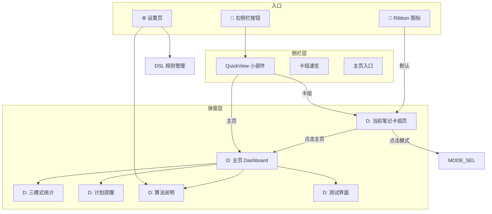

# 🎨 RemiFocus UI 重绘方案

> 版本: v1.0 | 状态: 设计方案（不动代码）
> 目标: 让 UI 真正配得上"学习操作系统"这五个字

---

## 📋 目录

1. [设计原则](#1-设计原则)
2. [三入口导航架构](#2-三入口导航架构)
3. [一级弹窗：当前笔记卡组页](#3-一级弹窗当前笔记卡组页)
4. [主页 Dashboard](#4-主页-dashboard)
5. [三模式专属统计视图](#5-三模式专属统计视图)
6. [整洁的测试界面](#6-整洁的测试界面)
7. [计划提醒专属页面](#7-计划提醒专属页面)
8. [算法描述页](#8-算法描述页)
9. [右侧边栏重构](#9-右侧边栏重构)
10. [全局导航方案](#10-全局导航方案)
11. [文件变更清单](#11-文件变更清单)

---

## 1. 设计原则

### 核心原则

> ❗ 不要堆砌功能，要**组织功能**

| 原则 | 说明 |
|------|------|
| **三入口统一** | 弹窗/侧栏/设置页 — 三种入口指向**同一套功能** |
| **渐进式披露** | 默认显示最重要的，高级功能藏在一层点击后 |
| **数据驱动** | 统计图表不是装饰，是决策依据 |
| **整洁 > 丰富** | 减少 chrome（边框/标签/ID），增加内容空间 |
| **模式感知** | 切换到 KU 模式就显示 KU 专属统计 |

### 用户心智模型

```text
🧠 Ribbon 图标
  → 当前笔记的卡组（默认，最快路径）
  → 如果需要全局视图 → 点"主页"
  → 如果需要切换模式 → 点"模式切换"
  → 如果需要看统计 → 主页内有图表
```

---

## 2. 三入口导航架构

### 整体导航图



### 三入口职责

| 入口 | 位置 | 默认行为 | 核心功能 |
|------|------|---------|---------|
| **Ribbon 图标 🧠** | Obsidian 左侧栏 | 打开"当前笔记的卡组页" | 主操作入口 |
| **右侧栏 QuickView** | Obsidian 右侧栏 | 显示概览小部件 | 快捷操作 + 速览 |
| **设置页 ⚙️** | Obsidian 设置 | 显示算法/DSL/通用设置 | 配置 + 学习 |

---

## 3. 一级弹窗：当前笔记卡组页

### 这是用户点击 Ribbon 后看到的**第一个页面**

```text
┌────────────────────────────────────────────────────────────┐
│ 🧠 RemiFocus                          [🏠 主页] [⚙️ 设置] │
│                                                             │
│  ── 当前笔记 ────────────────────────────────────────────  │
│  生理学/呼吸.md                                              │
│                                                             │
│  ┌──────────────────────────────────────────────────────┐   │
│  │ 📇 呼吸        │  📊 熟练度 ████████░░ 82%           │   │
│  │ 12 张卡片      │  📅 下次复习: 2026-06-25            │   │
│  │ 3 个知识单元   │  🔥 overdue: 0 张                   │   │
│  └──────────────────────────────────────────────────────┘   │
│                                                             │
│  [▶ 开始学习]  [🧠 KU 视图]  [📇 卡片列表]  [📊 统计]     │
│                                                             │
│  ── 同级卡组 ────────────────────────────────────────────  │
│  📁 生理学                                                  │
│    ├─ 呼吸      12张  ████████░░ 82%                       │
│    ├─ 循环      8张   ██████░░░░ 60%                       │
│    └─ 消化      15张  █████████░ 90%                       │
│                                                             │
│  📁 英语                                                    │
│    └─ 考研词汇  150张 ██████░░░░ 55%                       │
│                                                             │
│  [🤖 AI 制卡]  [快速制卡]  [🧠 KU模式]                     │
└────────────────────────────────────────────────────────────┘
```

### 关键设计点

| 元素 | 说明 |
|------|------|
| **顶部栏** | 标题 + 主页按钮 + 设置按钮（全局导航） |
| **当前笔记卡片** | 大卡片展示当前文件的卡组信息，无冗余 ID |
| **操作按钮** | 开始学习 / KU 视图 / 卡片列表 / 统计 |
| **同级卡组** | 按文件夹树形展示，熟练度进度条 |
| **底部模式切换** | 三个按钮切换制卡模式（手动/快速/KU） |

### 如果当前没有打开笔记

```text
┌────────────────────────────────────────────────────────────┐
│ 🧠 RemiFocus                          [🏠 主页] [⚙️ 设置] │
│                                                             │
│  📭 未打开笔记                                               │
│  请先在 Obsidian 中打开一篇 Markdown 笔记                     │
│                                                             │
│  ── 或者从已有卡组中选择 ──                                 │
│  📁 生理学/呼吸      12张   82%                             │
│  📁 生理学/循环      8张    60%                             │
│  📁 英语/考研词汇    150张  55%                             │
│  ...                                                       │
│                                                             │
│  [🏠 前往主页]                                              │
└────────────────────────────────────────────────────────────┘
```

---

## 4. 主页 Dashboard

### 完整布局

```text
┌─────────────────────────────────────────────────────────────────┐
│ 🏠 RemiFocus 主页                              [模式切换 ▼]     │
├─────────────────────────────────────────────────────────────────┤
│                                                                   │
│  ┌─ 左侧 55% ──────────────────┐ ┌─ 右侧 45% ───────────────┐  │
│  │                             │ │                            │  │
│  │ 📅 学习热力图                │ │ 📊 今日进度                │  │
│  │ ┌───┬───┬───┬───┬───┬───┐ │ │ ████████████░░ 75%          │  │
│  │ │   │   │   │ 1 │ 2 │ 3 │ │ │                            │  │
│  │ │ 4 │ 5 │ 6 │ 7 │ 8 │ 9 │ │ │ 今日目标: 20/30 张          │  │
│  │ │...│   │   │   │   │   │ │ │ 待复习: 12 张               │  │
│  │ └───┴───┴───┴───┴───┴───┘ │ │ 新学: 5 张                │  │
│  │                             │ │                            │  │
│  │ [日视图] [周视图] [月视图]   │ │ ── 趋势 ────              │  │
│  │                             │ │ 📈 折线图（7天）           │  │
│  │                             │ │ ┌──────────────────┐      │  │
│  │                             │ │ │ ╱╲    ╱╲         │      │  │
│  │                             │ │ │╱  ╲  ╱  ╲  ╱╲    │      │  │
│  │                             │ │ └──────────────────┘      │  │
│  │                             │ │ 每日学习量趋势              │  │
│  └─────────────────────────────┘ └────────────────────────────┘  │
│                                                                   │
│  ── 模式统计 ─────────────────────────────────────────────────   │
│  ┌──────────┐ ┌──────────┐ ┌──────────┐                        │
│  │ 🧱 手动   │ │ ⚙️ 快速  │ │ 🧠 KU    │                        │
│  │ 30 张     │ │ 120 张   │ │ 45 张    │                        │
│  │ 85% 掌握  │ │ 60% 掌握 │ │ 72% 掌握 │                        │
│  │ [详情]    │ │ [详情]   │ │ [详情]   │                        │
│  └──────────┘ └──────────┘ └──────────┘                        │
│                                                                   │
│  ── 快捷操作栏 ───────────────────────────────────────────────  │
│  [▶ 开始学习]  [📅 计划提醒]  [📐 算法说明]  [🧪 测试模式]      │
└─────────────────────────────────────────────────────────────────┘
```

### 热力图与折线图可切换

在图表区域上方增加 Tab 切换：

```text
[🔥 热力图] [📈 折线图(日)] [📈 折线图(周)] [📈 折线图(月)]
```

- **热力图**：GitHub contribution 风格，每个格子是一天
- **折线图(日)**：每日学习卡片数曲线
- **折线图(周)**：每周学习卡片数曲线
- **折线图(月)**：每月学习卡片数曲线

所有图表基于 `deck.json` 中的 `history` 数据计算，无需额外数据源。

---

## 5. 三模式专属统计视图

### 入口

从主页点击模式卡片上的 `[详情]` 按钮，或从顶部模式切换器进入。

```text
┌─────────────────────────────────────────────────────────────┐
│ 🧠 KU 模式专属统计                    [返回主页]            │
├─────────────────────────────────────────────────────────────┤
│                                                               │
│  ┌─ 概览 ─────────────────────────────────────┐              │
│  │ KU 总数: 45  |  投影卡片: 67  |  去重合并: 12 │              │
│  │ 平均掌握度: ████████░░ 72%   |  高错误率 KU: 3 │              │
│  └────────────────────────────────────────────────┘              │
│                                                               │
│  ┌─ 热力图 ────────────┐ ┌─ 折线图 ────────────┐              │
│  │ [KU 生成量]          │ │ [卡片生成量]          │              │
│  │ 日 一 二 三 四 五 六  │ │ ╱╲    ╱╲             │              │
│  │ ...                 │ │╱  ╲  ╱  ╲  ╱╲       │              │
│  └──────────────────────┘ └──────────────────────┘              │
│                                                               │
│  ── DSL 规则命中统计 ──────────────────────────────────────   │
│  rule_card     ████████████░░ 45 次                            │
│  vocab_highlight ████████░░░░ 30 次                            │
│  comparison_table ████░░░░░░░ 12 次                            │
│  paragraph     ██████████████ 50 次 (兜底)                     │
│                                                               │
│  ── 高频错误 KU ────────────────────────────────────────────  │
│  ⚠ 颈动脉体功能     错误率 60%  [查看详情]  [生成额外卡片]     │
│  ⚠ 肾小球滤过       错误率 45%  [查看详情]  [生成额外卡片]     │
└─────────────────────────────────────────────────────────────┘
```

同理，**手动模式**和**快速模式**的专属统计页面分别显示对应的指标。

### 三种模式统计维度对比

| 维度 | 🧱 手动 | ⚙️ 快速 | 🧠 KU |
|------|---------|---------|-------|
| 卡片总量 | ✅ | ✅ | ✅ |
| 掌握度 | ✅ | ✅ | ✅ |
| 制卡数量趋势 | ✅ 折线图 | ✅ 折线图 | ✅ 折线图 |
| KU 数量 | ❌ | ❌ | ✅ |
| DSL 规则命中 | ❌ | ❌ | ✅ |
| 去重合并统计 | ❌ | ❌ | ✅ |
| 手动制卡频率 | ✅ 热力图 | ❌ | ❌ |
| 自动提取频率 | ❌ | ✅ 热力图 | ✅ 热力图 |
| 高错误率 KU | ❌ | ❌ | ✅ |

---

## 6. 整洁的测试界面

### 当前问题

> 测试界面过于"技术化"，卡组 ID 和内部字段暴露太多

### 重设计

```text
┌───────────────────────────────────────────────┐
│ 🧪 测试                  生理学/呼吸  第 3/12 │
├───────────────────────────────────────────────┤
│                                               │
│  ┌─────────────────────────────────────────┐  │
│  │                                         │  │
│  │   颈动脉体的功能是什么？                  │  │
│  │                                         │  │
│  │   ┌─────────────────────────────────┐   │  │
│  │   │ 请输入你的答案...                │   │  │
│  │   └─────────────────────────────────┘   │  │
│  │                                         │  │
│  │   [确认]                                │  │
│  │                                         │  │
│  └─────────────────────────────────────────┘  │
│                                               │
│  ── 提示 ──────────────────────────────────   │
│  💡 提示：外周化学感受器                      │
│                                               │
│  设置: [🔄 模式: 拼写] [🔢 数量: 12] [⏱ 计时]│
└───────────────────────────────────────────────┘
```

### 关键设计点

| 改动 | 说明 |
|------|------|
| **隐藏内部 ID** | 不显示 `deck: "生理学/呼吸"` 这样的路径，只显示"生理学/呼吸" |
| **不要显示 kuId** | 内部 ID 如 `ku_a1b2c3d4` 对用户无意义，彻底隐藏 |
| **进度指示** | "第 3/12" 替代 "card_xxx_yyy"|
| **卡片内容居中** | 测试内容居中大号显示 |
| **底部设置栏** | 模式/数量/计时 设置放在底部，不干扰主内容 |
| **简洁提示** | 需要时才展开提示区域 |

### 测试完成的反馈

```text
┌───────────────────────────────────────────────┐
│  ✅ 本轮测试完成！                              │
│                                               │
│  ┌─────────────────────────────────────────┐  │
│  │  ✅ 正确: 8                              │  │
│  │  ❌ 错误: 4                              │  │
│  │  📊 正确率: 66%                         │  │
│  │                                         │  │
│  │  ████████░░░░░░░░░░                     │  │
│  │                                         │  │
│  │  错误卡片:                               │  │
│  │  • 颈动脉体功能 → 外周化学感受器(×)      │  │
│  │  • 肾小球滤过 → 原尿生成(×)              │  │
│  └─────────────────────────────────────────┘  │
│                                               │
│  [🔄 再来一轮]  [📋 查看详情]  [🏠 返回主页]  │
└───────────────────────────────────────────────┘
```

---

## 7. 计划提醒专属页面

### 这是一个独立弹窗

```text
┌───────────────────────────────────────────────┐
│ 📅 学习计划                              [⚙️] │
├───────────────────────────────────────────────┤
│                                               │
│  ┌─ 今日计划 ────────────────────────────┐    │
│  │ 🎯 今日目标: 30 张卡片                │    │
│  │ ✅ 已完成: 20/30                      │    │
│  │ ████████████████░░░░░░░░             │    │
│  │                                      │    │
│  │ 预计完成时间: 21:00                   │    │
│  │ 当前进度: 领先计划 10 分钟            │    │
│  └──────────────────────────────────────┘    │
│                                               │
│  ┌─ 待复习 ──────────────────────────────┐    │
│  │ 🔴 今日 overdue: 5 张                │    │
│  │ 🟡 明日预报: 8 张                    │    │
│  │ 🟢 本周总计: 35 张                   │    │
│  │                                      │    │
│  │ [▶ 立即复习]                          │    │
│  └──────────────────────────────────────┘    │
│                                               │
│  ┌─ 习惯追踪 ────────────────────────────┐    │
│  │ 连续学习: 🔥 5 天                    │    │
│  │ 本周打卡: ✅✅✅☑️☑️☑️☑️              │    │
│  │                                      │    │
│  │ 最佳学习时段: 晚上 8-10 点            │    │
│  └──────────────────────────────────────┘    │
│                                               │
│  ── 本周计划 ─────────────────────────────   │
│  周一  🔴 5  overdue                        │
│  周二  🟢 8                                 │
│  周三  🟢 12                                │
│  周四  🟡 3  (今日)                         │
│  周五  🟢 10                                │
│  周末  🟢 复习日                            │
└───────────────────────────────────────────────┘
```

### 提醒通知

当 overdue 超过阈值时，QuickView 和弹窗中都显示提醒：

```text
🔔 你有 5 张卡片 overdue！建议立即复习
[▶ 复习] [⏰ 稍后提醒] [❌ 忽略]
```

---

## 8. 算法描述页

### 入口

从主页点击 `[📐 算法说明]`，或从设置页进入。

```text
┌───────────────────────────────────────────────┐
│ 📐 调度算法                         [返回主页] │
├───────────────────────────────────────────────┤
│                                               │
│  当前算法: SM-2 [切换 ▼]                      │
│                                               │
│  ┌─────────────────────────────────────────┐  │
│  │ 🔵 SM-2 (基础)                          │  │
│  │                                         │  │
│  │ SuperMemo 经典算法，适合初学者。          │  │
│  │                                         │  │
│  │ 工作原理:                                │  │
│  │ 1. 新卡片初始间隔 1 天                    │  │
│  │ 2. 每次"良好"或"简单"后间隔翻倍           │  │
│  │ 3. 每次"困难"或"忘记"后间隔重置           │  │
│  │ 4. ease 因子动态调整                     │  │
│  │                                         │  │
│  │ 适合: 简单词汇、固定节奏学习              │  │
│  └─────────────────────────────────────────┘  │
│                                               │
│  ┌─────────────────────────────────────────┐  │
│  │ 🟢 FSRS-5 (高级) ⭐推荐                  │  │
│  │                                         │  │
│  │ 现代间隔重复算法，基于深度学习模型。       │  │
│  │                                         │  │
│  │ 特点:                                    │  │
│  │ • 使用 4 个参数优化记忆曲线               │  │
│  │ • 自适应个人记忆能力                      │  │
│  │ • 比 SM-2 精准 30%                      │  │
│  │ • Anki 官方推荐算法                      │  │
│  │                                         │  │
│  │ 适合: 医学笔记、长周期复习                │  │
│  └─────────────────────────────────────────┘  │
│                                               │
│  ┌─────────────────────────────────────────┐  │
│  │ 🟠 考试模式                              │  │
│  │ ...                                     │  │
│  └─────────────────────────────────────────┘  │
│                                               │
│  ┌─────────────────────────────────────────┐  │
│  │ ⚪ 固定间隔                              │  │
│  │ ...                                     │  │
│  └─────────────────────────────────────────┘  │
│                                               │
│  [应用此算法]                                  │
└───────────────────────────────────────────────┘
```

---

## 9. 右侧边栏重构

### 新 QuickView 布局

```text
┌─────────────────────────────┐
│ 🧠 RemiFocus                │
│                              │
│ ┌─────────────────────────┐ │
│ │ 🤖 AI 制卡               │ │ ← 主入口（三模式选择）
│ └─────────────────────────┘ │
│                              │
│ 📊 今日                      │
│ 待复习: 12 词 ████████░░    │
│ 新词: 5                     │
│                              │
│ [▶ 复习] [🏠 主页] [📅 计划]│
│                              │
│ ── 提醒 ────                │
│ 🔴 5 张卡片 overdue         │
│                              │
│ 📁 文件夹速览                │
│ 生理学 ████████░ 35词 72%   │
│ 英语   ██████░░░ 150词 55%  │
│                              │
│ 📈 今日趋势                  │
│ ╱╲    ╱╲                    │
│╱  ╲  ╱  ╲  ╱╲              │
│                              │
│ [⚙️ 设置]                    │
└─────────────────────────────┘
```

---

## 10. 全局导航方案

### 导航矩阵

| 当前页面 | 可跳转到 |
|---------|---------|
| 卡组页（默认） | 主页 / 设置 / 模式选择 / 学习 session / KU 视图 |
| 主页 Dashboard | 模式统计 / 计划提醒 / 算法说明 / 测试模式 / 设置 |
| 模式统计 | 主页 / 对应模式详情 / KU 列表 |
| 测试界面 | 结果页 / 主页 / 卡组页 |
| 计划提醒 | 主页 / 复习 session |
| 算法说明 | 主页 / 设置 |

### 所有新页面/弹窗清单

| 页面 | 类型 | 文件 | 说明 |
|------|------|------|------|
| 当前笔记卡组页 | Modal | `ui/deckView.ts` | **重构** 现有 `MainPopupModal` |
| 主页 Dashboard | Modal | `ui/home.ts` | **重构** 现有 `RemiDashboard` |
| 三模式统计页 | Modal | `ui/modeStats.ts` | **新建** |
| 计划提醒页 | Modal | `ui/planView.ts` | **新建**（替代现有 reminder.ts） |
| 算法说明页 | Modal | `ui/algoInfo.ts` | **新建** |
| 测试界面 | Modal | `ui/sessionView.ts` | **重构** 更整洁 |
| 右侧栏 QuickView | View | `ui/quickView.ts` | **重构** 已有 |
| 模式选择器 | Modal | `ui/mode-selector.ts` | **已有** |

### 现有文件修改清单

| 文件 | 改动 |
|------|------|
| [`ui/home.ts`](ui/home.ts) | 重写为 Dashboard（热力图+折线图切换+三模式卡片） |
| [`ui/popup.ts`](ui/popup.ts) | 重写为"当前笔记卡组页" |
| [`ui/quickView.ts`](ui/quickView.ts) | 增加今日趋势小折线图、计划入口 |
| [`ui/sessionView.ts`](ui/sessionView.ts) | 清理 UI，隐藏内部 ID，大号居中显示 |
| [`ui/reminder.ts`](ui/reminder.ts) | 升级为完整计划提醒页 |
| [`main.ts`](main.ts) | Ribbon 默认 → 当前笔记卡组页 |

### 无需修改的文件

| 文件 | 原因 |
|------|------|
| [`ui/heatmap.ts`](ui/heatmap.ts) | 热力图组件可复用 |
| [`ui/stats.ts`](ui/stats.ts) | 统计面板可复用 |
| [`ui/mode-selector.ts`](ui/mode-selector.ts) | 已有，无需改动 |
| [`ui/dsl-editor.ts`](ui/dsl-editor.ts) | 已有，无需改动 |
| [`ui/card-view.ts`](ui/card-view.ts) | 已有，KU 视图 |
| [`ui/ku-view.ts`](ui/ku-view.ts) | 已有，KU 知识树 |

---

## 附录 A：用户故事流程图

```text
第一次使用:
  Ribbon 🧠 → 当前笔记卡组页(无笔记提示)
    → 打开一篇笔记
    → 再次点击 Ribbon → 显示该笔记的卡组
    → 点击"开始学习" → 整洁的测试界面
    → 完成 → 查看结果

日常使用:
  Ribbon 🧠 → 查看今日待复习
    → 点击"主页" → 看热力图/折线图
    → 点击"计划提醒" → 看今日进度
    → 点击"开始学习" → 复习

高级使用:
  打开笔记 → 点击 KU 视图 → 查看知识单元
    → 切换到 KU 模式 → DSL 自动提取
    → 查看模式统计 → 调整 DSL 规则
```

## 附录 B：UI 状态机设计（v2 核心补充）

> 以下内容基于评审反馈整合，是防止未来 UI 爆炸的关键设计。

### B.1 UI 三层协议

所有 UI 强制归属到其中一层，不能越界：

```text
L1: Entry Layer（入口层）
    Ribbon / 右侧栏 / 快捷键
    → 只做一件事：进入系统

L2: Context Layer（上下文层）
    DECK_VIEW（当前笔记卡组页）
    SESSION_VIEW（学习界面）
    → 核心操作区（学习发生在这里）

L3: Insight Layer（洞察层）
    HOME_DASHBOARD / STATS / ALGO / PLAN
    → 只负责"理解与优化"，不直接学习
```

### B.2 三层状态模型

```typescript
// Layer 1: 全局路由（只有 6 个页面态）
type GlobalRoute =
  | "DECK_VIEW"    // 当前笔记卡组（默认入口）
  | "HOME"         // 主页 Dashboard
  | "SESSION"      // 测试/学习界面
  | "PLAN"         // 计划提醒
  | "ALGO"         // 算法说明
  | "SETTINGS";    // 设置/DSL

// Layer 2: 上下文（决定"在处理谁的数据"）
interface Context {
  currentNote?: string;
  currentDeck?: string;
  currentMode: "manual" | "classic" | "ku";
  currentKU?: string;
}

// Layer 3: 子模式（决定"同一个页面怎么显示"）
interface ViewMode {
  deckViewMode: "cards" | "ku" | "list";
  statsMode: "heatmap" | "line_day" | "line_week" | "line_month";
  sessionMode: "test" | "review" | "learn";
}
```

### B.3 UI 状态机流转图（v3 严格版）

```text
                        ┌────────────┐
                        │   START    │
                        └─────┬──────┘
                              │
                    ┌─────────▼──────────┐
                    │    DECK_VIEW       │◄──────────────┐
                    │  (唯一学习入口)     │               │
                    └─────────┬──────────┘               │
                              │                          │
              ┌───────────────┼───────────────┐          │
              ▼               ▼               ▼          │
        ┌──────────┐  ┌────────────┐  ┌────────────┐    │
        │ SESSION  │  │ HOME       │  │ PLAN       │    │
        │ 执行层   │  │ 状态看板   │  │ 调度解释器 │    │
        └────┬─────┘  └────────────┘  └────────────┘    │
             ▼                                           │
        ┌──────────┐                                     │
        │ RESULT   │  ┌────────────┐  ┌────────────┐    │
        │ 反馈决策  │  │ ALGO       │  │ SETTINGS   │    │
        └────┬─────┘  │ 算法说明   │  │ 设置/DSL   │    │
             ▼        └────────────┘  └────────────┘    │
        ┌──────────┐                                     │
        │ DECK_VIEW│─────────────────────────────────────┘
        └──────────┘
```

### B.4 关键流转规则（v3 严格版）

#### 强制分层

```text
🟦 L1: 执行层（唯一学习主线）
  DECK → SESSION → RESULT → DECK
  → 不允许跳过 DECK
  → SESSION 不能从 HOME/PLAN 直接进入

🟨 L2: 控制层（入口调度）
  HOME / PLAN / QUICKVIEW
  → 只能"调度 DECK"
  → 不能直接产生 SESSION

🟥 L3: 认知层（解释系统）
  ALGO / SETTINGS / STATS
  → 完全不参与学习流
  → 只是"理解系统"
```

#### 默认入口（Session Resume）

```text
Ribbon 点击逻辑：
  if (有进行中的 session):
      → SESSION (继续学习)
  else if (当前有打开的笔记):
      → DECK_VIEW (当前笔记卡组)
  else:
      → HOME (主页)
```

#### 单入口原则

```text
1. 任何页面可以从 DECK_VIEW 到达
2. 任何页面可以回到 DECK_VIEW
3. 从任何页面到 SESSION 不超过 2 步
```

#### Stack Router（弹窗堆叠规则）

```text
BASE: DECK_VIEW（底层固定）

OVERLAY STACK:
  Level 1: 功能弹窗（HOME / SESSION / PLAN / ALGO）
  Level 2: 临时子弹窗（确认 / 提示 / 快速设置）

规则：最多 2 层 overlay，不能无限堆叠
```

### B.5 全局导航条（Global Context Bar）

每个页面的**顶部固定栏**，用户永远不会迷路：

```text
┌─────────────────────────────────────────────────────┐
│ 🧠 RemiFocus  │  📘 生理学/呼吸  │  🧠 KU  │  🔥 12/30 │
└─────────────────────────────────────────────────────┘
     Logo/主页      当前上下文         模式      今日进度
```

内容：

| 字段 | 说明 | 点击行为 |
|------|------|---------|
| `🧠 RemiFocus` | 系统 Logo | 回到 DECK_VIEW |
| `📘 当前笔记` | 当前上下文 | 切换笔记 |
| `🧠 KU` | 当前模式 | 打开模式选择器 |
| `🔥 12/30` | 今日进度 | 打开 PLAN_VIEW |

### B.6 图表解释机制

所有图表下方固定一行"解释 + 建议"：

```text
📊 热力图
┌───┬───┬───┬───┬───┐
│   │   │   │   │   │
└───┴───┴───┴───┴───┘
📌 最近 3 天学习下降 → 建议开启"轻量复习模式" [开启]
```

```text
📈 折线图
╱╲    ╱╲
╱  ╲  ╱  ╲  ╱╲
📌 掌握度稳步上升 → 继续保持当前节奏 👍
```

### B.7 Session（测试界面）状态机

```text
SESSION_VIEW:
  ├─ 完成测试 → RESULT_VIEW
  ├─ ESC      → DECK_VIEW (保留 session state)
  ├─ 暂停     → DECK_VIEW (可恢复)
  └─ 设置     → OVERLAY(设置抽屉, 不离开 session)
```

### B.8 Sidebar 定位（v3 严格版）

右侧栏不是页面，是"状态跳板"，**不能直接进入 SESSION**：

```text
SIDEBAR 只允许 4 种跳转：
  → [AI 制卡]   → MODE_SELECTOR (overlay)
  → [主页]      → HOME
  → [当前卡组]   → DECK_VIEW（必须）
  → [计划]      → PLAN
  → [设置]      → SETTINGS

❌ 禁止：
  → SESSION（必须从 DECK 进入）
  → RESULT
```

### B.9 与现有 UI 文件的映射

| 状态机路由 | UI 文件 | 说明 |
|-----------|---------|------|
| `DECK_VIEW` | `ui/popup.ts` | 重写为当前笔记卡组页 |
| `HOME` | `ui/home.ts` | 重写为 Dashboard |
| `SESSION` | `ui/sessionView.ts` | 整洁化 |
| `PLAN` | `ui/planView.ts` | **新建** |
| `ALGO` | `ui/algoInfo.ts` | **新建** |
| `SETTINGS` | `main.ts` 设置页 | 已有 |
| — | `ui/quickView.ts` | 重构为状态跳板 |
| — | `core/ui-router.ts` | **新建** 状态机 |

### B.10 新增核心文件

| 文件 | 职责 |
|------|------|
| `core/ui-router.ts` | UI 状态机核心（Route + Context + ViewMode） |
| `ui/planView.ts` | 计划提醒页面 |
| `ui/algoInfo.ts` | 算法说明页面 |

### B.11 v3 关键强化：RESULT 升级 + HOME 降级

#### RESULT 升级为「闭环决策中心」

SESSION 结束后不只是一个结果展示，而是：

```text
SESSION → RESULT → 决策 → DECK
```

RESULT 做三件事：

```text
📊 本轮表现
   ✅ 正确: 8 | ❌ 错误: 4 | 📊 正确率: 66%

🧠 记忆模型建议
   建议: KU 模式下调难度
   错误卡片: 颈动脉体功能 (错误 3 次)
   
🔁 下一步行动
   [🔄 再来一轮]  [📋 查看详情]
   [⚡ 自动生成补充卡]  [🏠 返回卡组]
```

#### HOME 降级为「状态看板」

HOME 不再做控制中心，只保留：

```text
📊 今日状态
  待复习: 12 | 已学: 20/30 | 连续: 🔥5天

🔥 热力图（可切换）
📈 一条趋势图（7天）

▶ 最近卡组入口（最多 3 个）
  生理学/呼吸  ████████░░ 82%
  生理学/循环  ██████░░░░ 60%
  英语/考研    ██████░░░░ 55%
```

❌ 从 HOME 删除：

| 删除项 | 原因 | 移到哪里 |
|--------|------|---------|
| 三模式统计卡片 | HOME 太胖 | 移到 PLAN/STATS |
| 快捷开始学习按钮 | 不能直接从 HOME 进 SESSION | DECK 专属 |
| 算法切换 | 认知层不参与学习流 | ALGO 专用页 |
| KU 视图入口 | 结构层不混在洞察层 | DECK_VIEW |

#### 完整流转约束总表

| 从 | 到 | 是否允许 | 说明 |
|---|----|---------|------|
| DECK | SESSION | ✅ **唯一入口** | 系统的"心脏" |
| DECK | HOME | ✅ | 看状态 |
| DECK | PLAN | ✅ | 看计划 |
| DECK | KU_VIEW | ✅ | 切换视图模式 |
| HOME | DECK | ✅ | 回主入口 |
| HOME | SESSION | ❌ **禁止** | 必须回 DECK |
| HOME | PLAN | ✅ | 看计划 |
| HOME | ALGO | ✅ | 看算法 |
| PLAN | DECK | ✅ | 回主入口 |
| PLAN | SESSION | ❌ **禁止** | 必须回 DECK |
| SESSION | RESULT | ✅ | 完成学习 |
| RESULT | DECK | ✅ | 闭环终点 |
| RESULT | SESSION | ✅ | 再来一轮 |
| QUICKVIEW | SESSION | ❌ **禁止** | 必须回 DECK |
| QUICKVIEW | DECK | ✅ | 必须 |
| QUICKVIEW | HOME | ✅ | 看状态 |
| QUICKVIEW | PLAN | ✅ | 看压力 |
| QUICKVIEW | SETTINGS | ✅ | 设置 |

---

## 附录 C：最终设计决策记录（v3 最终版）

| 决策 | 选择 | 理由 |
|------|------|------|
| 系统架构 | **单主线 + 三辅助系统** | 防止多中心导致的路径混乱 |
| Ribbon 默认页 | **Session Resume**（优先恢复学习） | Obsidian 用户预期 Ribbon=全局入口 |
| UI 层级 | **三层协议**（执行层/控制层/认知层） | 防止页面无限增长 |
| SESSION 入口 | **仅 DECK 可进入** | 系统的"心脏"，路径唯一 |
| HOME 定位 | **状态看板**，不是控制中心 | 降级 HOME 防止吞掉 DECK |
| RESULT 定位 | **闭环决策中心**（不只是展示） | 给出下一步建议，形成学习闭环 |
| 导航模型 | **状态机**（Route+Context+ViewMode） | 替代"页面思维"，防止路径爆炸 |
| 弹窗策略 | **Stack Router**（最多2层overlay） | 防止弹窗地狱 |
| 全局导航 | **Global Context Bar** | 用户永不迷路 |
| 统计图表 | 热力图+折线图可切换 | 满足不同视角的数据分析需求 |
| 图表解释 | **每图一行「这说明什么+我该怎么做」** | 让数据有行动指导 |
| 测试界面 | 居中大号+隐藏 ID+设置抽屉 | 减少干扰，专注卡片内容 |
| 计划提醒 | 独立弹窗（调度解释器） | 只做负载分析，不做学习入口 |
| 算法说明 | 可读描述+切换按钮 | 用户需要理解算法才能信任它 |
| 右侧栏 | **状态跳板**，禁止直接进 SESSION | 保持轻量，不参与路由 |
